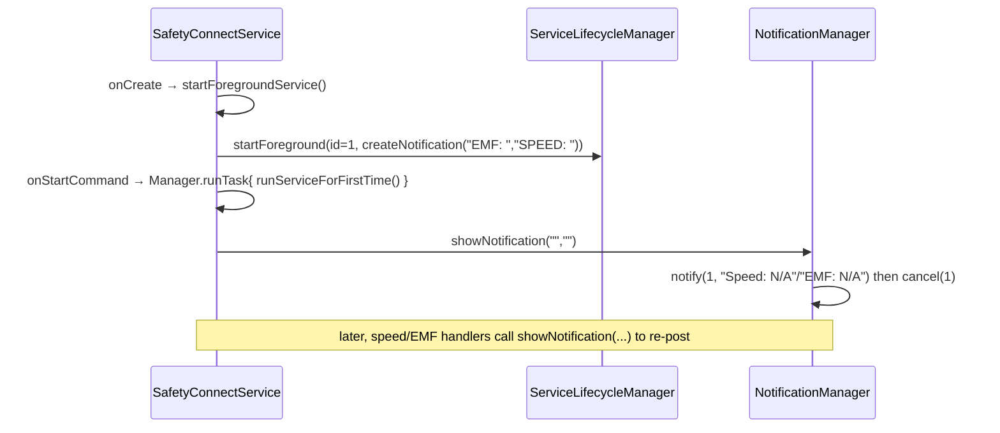

# CURRENT_IMPLEMENTATION.md

> **Purpose:** an accurate description of what the SafetyConnect SDK does **today**.
> **Derivation:** re-read directly from the current source tree
> (branch `claude/speed-detection-timeout-issue-abg3s4`, working tree `2a85bbd`;
> code identical to `main` `c3a21a0`). No external documents, no prior designs,
> no proposals.
> **Line numbers** are as of this tree; **symbol names** (class/method/field) are
> the stable references.
> **Files read for this document:** `SafetyConnectSDK.kt`,
> `foreground/SafetyConnectService.kt`, `foreground/CurrentLocation.kt`,
> `foreground/speed/SpeedManager.kt`, `foreground/util/SpeedExtensions.kt`,
> `model/SpeedReading.kt`, `foreground/notification/NotificationManager.kt`,
> `foreground/lifecycle/ServiceLifecycleManager.kt`,
> `foreground/permission/PermissionValidator.kt`,
> `foreground/activity/TripGate.kt`, `foreground/harsh/*`, `foreground/emf/EmfDetector.kt`,
> `utils/Manager.java`, `sdkinit/*`, `repoimpl/*`, `service/ApiService.kt`,
> `network/NetworkModule.kt`, `AndroidManifest.xml`.

---

## 1. High-Level Architecture

The SDK is an Android library module (`com.test.safetyconnect`). Two largely
independent runtime subsystems exist:

**A. Foreground safety pipeline** — a `Service` (`SafetyConnectService`) that reads
device sensors and GPS and produces speed / EMF / harsh-driving signals, surfaced
via callbacks and a foreground notification. **No network.**

**B. Sensor-upload / crash pipeline** — an in-process object graph
(`SafetyConnect` → `AccidentDetector` → `SensorInteractImpl` → `DataInteractImpl` →
`SendDataListenerImpl` → `NetworkModule`) that batches raw accelerometer / gyroscope /
magnetometer samples and POSTs them to a backend. This is the **only** network user.

Major components and responsibilities (as implemented):

| Component | File | Responsibility (today) |
|---|---|---|
| `SafetyConnectSDK` | `SafetyConnectSDK.kt` | Public facade; holds global static state (`sensorFilters`, `activity` weak-ref, registered callbacks); starts/stops the service and the crash pipeline; fan-out of callbacks. |
| `SafetyConnectService` | `foreground/SafetyConnectService.kt` | Foreground `Service`; `SensorEventListener` + `CurrentLocation.GetLocation`; owns detectors; runs the location→speed→overspeed decision and the notification. |
| `CurrentLocation` | `foreground/CurrentLocation.kt` | `LocationListener` wrapper around `LocationManager` `GPS_PROVIDER`. |
| `SpeedManager` | `foreground/speed/SpeedManager.kt` | Speed validation, stationary handling, jump rejection, rolling-window median; returns `SpeedResult`. |
| `TripGate` | `foreground/activity/TripGate.kt` | Activity-Recognition transition subscription exposing `isDriving` (see §6; currently bypassed — §7/§9). |
| `EmfDetector` | `foreground/emf/EmfDetector.kt` | Magnetic-field processing (gated off by default). |
| `HarshDrivingDetector` / `AccelerometerWindow` | `foreground/harsh/*` | Harsh accel/brake detection using GPS + accelerometer. |
| `NotificationManager` | `foreground/notification/NotificationManager.kt` | Builds/updates/cancels the foreground notification. |
| `ServiceLifecycleManager` | `foreground/lifecycle/ServiceLifecycleManager.kt` | `startForeground` / `stopForeground` / `stopSelf` wrappers. |
| `PermissionValidator` | `foreground/permission/PermissionValidator.kt` | Location / notification / activity-recognition permission checks. |
| `Manager` | `utils/Manager.java` | Process-wide `ThreadPoolExecutor` (core 5 / max 10, unbounded queue) used via `runTask{}`. |
| `SafetyConnect`, `AccidentDetector`, `ImageDetector` | `sdkinit/*` | Crash + image/equipment pipeline setup. |
| `SensorInteractImpl`, `DataInteractImpl`, `SendDataListenerImpl` | `repoimpl/*` | Raw-sensor capture, timed batching, and HTTP upload. |
| `ApiService` / `NetworkModule` | `service/`, `network/` | Retrofit endpoint definitions and OkHttp client. |

---

## 2. SDK Initialization

**Entry:** `SafetyConnectSDK.initSDK(sensorFilters, activity, registerForCallBack)`.

1. Plants a Timber `DebugTree` if none exists (`initSDK`, line 39–41).
2. Stores the activity as `activity = WeakReference(activity)` (line 43).
3. `initializeSensorFilter(sensorFilters)` (line 49): if the global
   `this.sensorFilters` is null, creates a fresh `SensorFilters()` (all defaults),
   then copies a **fixed list** of fields from the caller's object (lines 52–75).
4. `addActiveListener(registerForCallBack)` (line 153): if no callback is yet
   registered for `sensorFilters.safetyType`, registers it in the
   `ConcurrentHashMap` and invokes `registerForCallBack.onSdkInitialized()` **once**.

**Service start (separate call):** `SafetyConnectSDK.startService(activity)`
(line 257):
- Returns early (notifying callbacks) if notifications are disabled, or if fine
  **and** coarse **and** foreground-service-location permissions are all denied
  **and** GPS is enabled (lines 259–279).
- Calls the private `startService(sensorFilters)` (line 175) which builds the
  **crash pipeline**: `SafetyConnect().init(...)` → `enableSafetySensor(true)
  .enableSafetySensorFeedback(true).enableSensorFrequency(sensorDataFrequency ?: 15000)
  .initSensor()` → `getAccidentDetectorInstance().initSensorsAPIResponse{...}` →
  `getFeedbackCallback{...}` → `bindSensor()`; then enables equipment/image detection.
- Then `intent.action = ACTION_START_OR_RESUME_SERVICE` and
  `activity.startService(intent)` (line 298–299) — starts `SafetyConnectService`
  (via `startService`, **not** `startForegroundService`).

**Components created at start:**
- On the SDK side: `SafetyConnect`, `AccidentDetector` (+ its `SensorInteractImpl`/
  `DataInteractImpl` when the detector is enabled), `ImageDetector`.
- Inside the service `onCreate`/`initializeManagers`: `SpeedManager`,
  `HarshDrivingDetector` (with an `AccelerometerWindow`), `NotificationManager`,
  `ServiceLifecycleManager`, `EmfDetector` (via `initMediaPlayer`), `TripGate`
  (+ `startTripGate`). `CurrentLocation` is created later in `onStartCommand`
  (`startSpeedService`) if speed detection is enabled.

**Configuration propagation:** the caller's `SensorFilters` is **not** stored by
reference; `initializeSensorFilter` copies field-by-field into the global
`SafetyConnectSDK.sensorFilters`. All components read configuration from that global
object (`SafetyConnectSDK.sensorFilters?...`). **Fields not present in the copy list
(lines 52–75) retain the freshly-constructed defaults** — see §7/§9.

---

## 3. Location Pipeline

1. **Creation:** `SafetyConnectService.onStartCommand` → `startSpeedService()`.
   `CurrentLocation(this)` is created **only if**
   `sensorFilters.isSpeedDetectionEnabled == true` **and** `locationManager == null`.
2. **Subscription:** `CurrentLocation.init` → `location()` (line 36):
   - Obtains `LocationManager`; runs `PermissionValidator.validateLocationPermissions`.
     If invalid, notifies the relevant callback and returns (no updates).
   - `provider = LocationManager.GPS_PROVIDER` (line 55).
   - If `isProviderEnabled(GPS_PROVIDER) == true` **or** `BuildConfig.DEBUG` (line 57):
     - Forwards one `getLastKnownLocation(GPS_PROVIDER)` (if non-null) through
       `onLocationChanged` (line 58–59).
     - Requests updates: API ≥ S uses `LocationRequest.Builder(2000L)
       .setMinUpdateDistanceMeters(1f).setQuality(QUALITY_HIGH_ACCURACY)`; older APIs
       use `LocationRequestCompat` equivalent. Delivery executor is
       `ContextCompat.getMainExecutor(context)` — **the main thread** (lines 61–87).
   - Else (provider disabled, non-debug): `getLocation.onProviderDisabled(...)` + a
     `Toast` (line 88–91).
3. **Delivery:** `CurrentLocation.onLocationChanged(location)` →
   `getLocation.onLocationChanged(location)`. `getLocation` is the `SafetyConnectService`
   (`context as GetLocation`, line 26).
4. **Service entry:** `SafetyConnectService.onLocationChanged(location)`:
   - If `serviceKilled` → `notificationManager.hideNotification()` and return.
   - Else → `processLocationUpdate(location)`.
5. **Gate:** `processLocationUpdate` first evaluates the trip-gate guard
   `if (!DEBUG_BYPASS_TRIP_GATE && gateOnInVehicle == true && isDriving != true) return`.
   **`DEBUG_BYPASS_TRIP_GATE` is `true` in the current tree**, so the guard
   short-circuits and every location proceeds.
6. **Into detection:** `speedManager.processLocation(location)` is called and the
   returned `SpeedResult` is dispatched.

`removeLocation()` (`locationManager.removeUpdates(this)`) is called from
`pauseService()` (on `ACTION_PAUSE_SERVICE` and inside `killService`).

---

## 4. Speed Detection (traced, not simplified)

**Where speed comes from / who computes it.** The **primary** speed is
`location.speed` — the value Android/GPS attaches to the fix. The SDK does **not**
compute the reported speed from coordinates. `SpeedManager.processLocation` reads
`location.speed` (line 55). The SDK **does** compute a *secondary* distance/time
speed (`distance / timeDelta * 3.6`) **only** inside jump validation
(`validateLocationJump`, `calculateMedianSpeedFromHistory`) — used to reject GPS
jumps, never reported as the speed.

**Conversion to km/h.** `Float.convertToKmPerHr()` (`SpeedExtensions.kt`) =
`value * 18 / 5` ( = ×3.6 ), rounded to 2 decimals via `BigDecimal(HALF_UP)`.
Applied at `SpeedManager.kt:55` (`location.speed.convertToKmPerHr()`).

**Step-by-step `processLocation` (returns a `SpeedResult`):**
1. **Basic validation (STEP 1):**
   - `if (location.accuracy > 50f)` → `SpeedResult.Rejected("Poor accuracy…")`
     (`MAX_ACCURACY_THRESHOLD = 50f`).
   - `if (!location.hasSpeed())` → `SpeedResult.Rejected("No speed data")`.
2. **`currentSpeed = location.speed.convertToKmPerHr()`.**
3. **Stationary (STEP 2):** `stationarySpeedThreshold = sensorFilters?.stationarySpeedKmh ?: 2f`.
   If `currentSpeed < threshold`: **clear** `locationHistory` and `speedReadings`,
   add the current location to history, return `SpeedResult.Stationary(location)`.
4. **Jump validation (STEP 3):** only `if (locationHistory.isNotEmpty())`. Calls
   `validateLocationJump`:
   - Reference = median snapshot of `locationHistory` (`getMedianLocationSnapshot`).
   - `distance = reference.distanceTo(location)`; `timeDelta = (location.time − ref.timestamp)/1000`.
   - If `timeDelta < 0.5s` (`MIN_TIME_DELTA_SECONDS`) → reject.
   - `calculatedSpeed = distance/timeDelta*3.6`. **Detailed checks run only if
     `calculatedSpeed > 140f`** (`MAX_REALISTIC_SPEED`):
     - If `locationHistory.size >= 3`: compute `medianSpeed` from history.
       - `medianSpeed > 140` → reject ("GPS jump").
       - If `distance > 50f` and both have bearing: bearing delta vs
         `maxAllowedBearing` (`medianSpeed>80 → 30°`, `>50 → 45°`, else `60°`); exceed → reject.
       - If `medianSpeed > 10`: `calculatedSpeed/medianSpeed > 1.5`
         (`MEDIAN_SPEED_VARIANCE_THRESHOLD`) → reject ("Speed jump").
     - Else (history < 3) → reject ("Insufficient history").
   - Otherwise valid.
5. **Accept (STEP 4) — `acceptLocation`:**
   - Add to `locationHistory` (cap 5; `removeAt(0)` when exceeded).
   - Build a `SpeedReading(speed=currentSpeed, timestamp=System.currentTimeMillis(),
     accuracy, latitude, longitude)`; add to `speedReadings` (cap 5).
   - If `speedReadings.size < 5` (`MAX_LOCATIONS`) → `SpeedResult.Collecting(currentSpeed, location)`.
   - Else → `medianSpeed = calculateMedianSpeed(speedReadings)` (median of the 5
     stored km/h speeds) → `SpeedResult.Valid(currentSpeed, medianSpeed, location)`.

**Smoothing / median.** `calculateMedianSpeed` sorts the `speed` field of the up-to-5
`speedReadings` and takes the median (even count → average of the two middle values).
There is no other smoothing of the reported speed.

**Rejection paths (exhaustive):** poor accuracy (>50 m), no speed data, time delta
< 0.5 s, GPS jump (history median > 140), unrealistic turn (bearing), speed jump
(ratio > 1.5), insufficient history for an unrealistic reading.

**Overspeed comparison** (in `SafetyConnectService.handleValidSpeed`, reached only on
`SpeedResult.Valid`): `if ((sensorFilters?.maxSpeedThreshold ?: 0f) <= medianSpeed)`
→ `fireOverSpeedingEvent(location.apply { speed = medianSpeed / 3.6f })`. Note the
comparison uses **`medianSpeed`**, and the location's `speed` is overwritten to
`medianSpeed / 3.6` (m/s) before the event.

**Callback generation** (`fireOverSpeedingEvent`): throttled — inside
`synchronized(lastOverSpeedDetected)`, fires only if
`now − lastOverSpeedDetected ≥ (speedCallBackFrequency ?: 30000)`. On fire it sets
`lastOverSpeedDetected = now` and calls
`notifyAllOverSpeedDetectedListener(location, sensorFilters?.speedDetectionEdge)`.
`lastOverSpeedDetected` is reset to `now` in `initializeDetectors()` on **every**
`onStartCommand`.

On `Collecting`/`Stationary`/`Valid`, the service also updates the notification text
(see §5). `Rejected` only logs; `null` (speedManager missing) only logs.

---

## 5. Overspeed Detection

**Classes involved:** `SafetyConnectService`, `SpeedManager`, `SafetyConnectSDK`
(fan-out), `SafetyConnectCommunicator` (host interface), `NotificationManager`.

**Methods involved:**
- `SafetyConnectService.onLocationChanged` → `processLocationUpdate` →
  `handleValidSpeed` → `fireOverSpeedingEvent`.
- `SpeedManager.processLocation` → `acceptLocation` → `calculateMedianSpeed`.
- `SafetyConnectSDK.notifyAllOverSpeedDetectedListener` → host
  `SafetyConnectCommunicator.overSpeedDetected(location, speedDetectionEdge)`.
- `NotificationManager.createNotification` / `showNotification`.

**Thresholds / configuration used:** `maxSpeedThreshold` (default 60),
`speedCallBackFrequency` (default 30 000 ms), `stationarySpeedKmh` (default 2),
`speedDetectionEdge` (default null); plus `SpeedManager` compile-time constants
(`MAX_LOCATIONS=5`, `MAX_ACCURACY_THRESHOLD=50`, `MAX_REALISTIC_SPEED=140`,
`MIN_TIME_DELTA_SECONDS=0.5`, `MEDIAN_SPEED_VARIANCE_THRESHOLD=1.5`,
`MAX_BEARING_CHANGE_DEGREES=60`, `MIN_DISTANCE_FOR_BEARING_CHECK=50`).

**Event generation:** `notifyAllOverSpeedDetectedListener` iterates the registered
callbacks (`ConcurrentHashMap` values) and calls `overSpeedDetected` on each. The
`location` passed has its `speed` field = `medianSpeed / 3.6` (m/s).

**Notification flow:** `handleValidSpeed` calls
`notificationManager.showNotification(lastKnownEmf, "Speed: <location.speed.convertToKmPerHr()> km/hr")`.
`NotificationManager.createNotification` inflates `R.layout.notification_main`
(`RemoteViews`), setting `txt_speed` to the passed string (or `"Speed: N/A"` when
empty) and `txt_emf` similarly; builds an ongoing, silent, `PRIORITY_HIGH`
notification on channel `"1"` (`NOTIFICATION_ID = 1`). `showNotification("","")`
posts then immediately `cancel(NOTIFICATION_ID)`.

**Sequence — location to overspeed callback:**
```mermaid
sequenceDiagram
    participant OS as Android LocationManager (GPS_PROVIDER)
    participant CL as CurrentLocation
    participant SVC as SafetyConnectService
    participant SM as SpeedManager
    participant SDK as SafetyConnectSDK
    participant HOST as Host callback

    OS->>CL: onLocationChanged(location) [main thread]
    CL->>SVC: getLocation.onLocationChanged(location)
    alt serviceKilled
        SVC->>SVC: notificationManager.hideNotification(); return
    else
        SVC->>SVC: processLocationUpdate(location)
        Note over SVC: gate guard (DEBUG_BYPASS_TRIP_GATE=true → skipped)
        SVC->>SM: processLocation(location)
        SM-->>SVC: SpeedResult (Stationary | Collecting | Valid | Rejected)
        alt Valid
            SVC->>SVC: handleValidSpeed(currentSpeed, medianSpeed, location)
            alt maxSpeedThreshold <= medianSpeed
                SVC->>SVC: fireOverSpeedingEvent (throttle speedCallBackFrequency)
                SVC->>SDK: notifyAllOverSpeedDetectedListener(location, speedDetectionEdge)
                SDK->>HOST: overSpeedDetected(location, speedDetectionEdge)
            end
            SVC->>SVC: notificationManager.showNotification(emf, "Speed: N km/hr")
        end
    end
```

**Sequence — notification lifecycle (startup):**


---

## 6. Current State Management

State touched by speed detection and where it lives:

**In `SpeedManager` (per-instance; the service owns one):**
- `locationHistory: CopyOnWriteArrayList<LocationSnapshot>` — last ≤5 accepted
  locations (snapshot: location, timestamp, speed, lat, lon).
- `speedReadings: CopyOnWriteArrayList<SpeedReading>` — last ≤5 accepted km/h readings.
- Cleared on `Stationary` and on `clear()`.

**In `SafetyConnectService` (per-instance fields):**
- `currentLocation: Location?` — last processed location.
- `disableEmfSpeedInKmHr: Float` — last speed handed to the EMF path (0 on stationary).
- `lastKnownEmf`, `lastKnownSpeed: String` — notification text state
  (init `"EMF: "`, `"SPEED: "`).
- `lastOverSpeedDetected: AtomicLong` — throttle timestamp; reset each `onStartCommand`.
- `isFirstRun`, `serviceKilled: Boolean` — lifecycle flags (not `@Volatile`).
- `gateSuppressionLogged: Boolean` — log-once flag for the gate.
- `DEBUG_BYPASS_TRIP_GATE: Boolean` (val, `true`) — disables the gate.
- `sensorManager`, `emfSensor`, `accelerometerSensor` — sensor handles.
- `locationManager: CurrentLocation?` — the GPS wrapper.
- `speedManager`, `harshDrivingDetector`, `notificationManager`, `lifecycleManager`,
  `tripGate`, `emfDetector`, `accelerometerWindow`, `coroutineScope`.

**In `TripGate` (per-instance; owned by the service):**
- `_isDriving: MutableStateFlow<Boolean>` (starts `false`) exposed as `isDriving`.
- `sustainJob`, `registered`, `pendingIntent`, `receiver`. *(Trip state exists and is
  maintained, but is not consulted while `DEBUG_BYPASS_TRIP_GATE == true`.)*

**In `SafetyConnectSDK` companion (process-global / static):**
- `sensorFilters: SensorFilters?` — the single configuration object all components read.
- `activity: WeakReference<Activity>?`.
- `registerForCallBack: ConcurrentHashMap<SafetyTypes, SafetyConnectCommunicator?>`.
- `safetyConnect`, `detector: WeakReference<…>`; `sdkVersion: String`.

There is no persistent (disk) state for speed detection; all speed state is in-memory
and per-service-instance except the global `sensorFilters`.

---

## 7. Configuration (items affecting speed detection)

| Item | Source | Default | Consumed by | Runtime effect |
|---|---|---|---|---|
| `isSpeedDetectionEnabled` | `SensorFilters`, copied in `initializeSensorFilter` | `false` | `SafetyConnectService.startSpeedService` | Gate for creating `CurrentLocation`; if not `true`, no GPS subscription → no speed detection. |
| `maxSpeedThreshold` | copied | `60f` | `handleValidSpeed` | Overspeed comparand (`≤ medianSpeed` fires). |
| `speedCallBackFrequency` | copied | `30_000L` | `fireOverSpeedingEvent` | Minimum interval between `overSpeedDetected` callbacks. |
| `speedDetectionEdge` | copied | `null` | `fireOverSpeedingEvent`/fan-out | Passed straight through to `overSpeedDetected`. |
| `safetyType` | copied | `null` | `addActiveListener` | Key under which the callback is registered; fan-out iterates all values regardless. |
| `stationarySpeedKmh` | `SensorFilters` **but NOT copied** in `initializeSensorFilter`; `val` | `2f` | `SpeedManager.processLocation` (and `HarshDrivingDetector`) | Below this km/h → `Stationary` (clears the window). **Always the default** (see §9). |
| `gateOnInVehicle` | `SensorFilters` **but NOT copied**; `var` | `true` | `processLocationUpdate`, `startTripGate` | Would gate the pipeline on `isDriving`; **currently overridden by `DEBUG_BYPASS_TRIP_GATE=true`**. Also set `false` at runtime by `startTripGate` if activity-recognition permission is absent. |
| `inVehicleSustainSeconds` | `SensorFilters` **but NOT copied**; `val` | `30` | `TripGate.scheduleDrivingConfirm` | Sustain time before `isDriving` becomes true. Affects the (currently bypassed) gate only. |
| `harshDrivingCaptureEnabled` | copied | `false` | `handleValidSpeed` | Gates the `harshDrivingDetector.analyze(location)` call on the `Valid` path (harsh, not overspeed). |

Non-configurable constants that shape speed detection: `SpeedManager` companion
constants (§5) and `CurrentLocation`'s hard-coded `GPS_PROVIDER`, `2000L` interval,
`1f` min displacement, `QUALITY_HIGH_ACCURACY`.

---

## 8. Network Usage

**Endpoints defined** (`ApiService`, all `POST`, relative to
`NetworkModule.BASE_URL = "https://api.example.com/safetyconnect/"`):

| Path | Method | Purpose (as wired) | Trigger |
|---|---|---|---|
| `data` | `updateSensorData(SensorDataModel)` | Upload batched accelerometer/gyroscope/magnetometer samples + device details. | `DataInteractImpl` `Timer` → `SendDataListenerImpl.sendSensorData`. |
| `label` | `updateFeadbackSensorData(FeadbackRequestModel)` | Crash feedback labelling. | `AccidentDetector.sendFeedbackAPI` (feedback flow). |
| `label_image` | `updateImageDetectionFeedbackData(...)` | Image-detection feedback. | Image/equipment flow. |
| `image_check` | `uploadImage(MultipartBody.Part)` | Multipart image upload. | Image/equipment flow. |
| `check_2W` | `uploadImageForBikeHelmet(MultipartBody.Part)` | Multipart image upload. | Image/equipment flow. |

**Client** (`NetworkModule`): Retrofit + Gson + RxJava2 over OkHttp; 60 s connect/
read/write/call timeouts; 10 MB disk cache; `retryOnConnectionFailure(true)`; a
hard-coded `Authorization: Basic dGVzdDp0ZXN0` header interceptor (base64 `test:test`,
with a `TODO` to replace); `HttpLoggingInterceptor(BODY)` and `StethoInterceptor`
added only in `BuildConfig.DEBUG`.

**The recurring request** is `data`: `DataInteractImpl.onTimerStart` schedules a
`Timer` at `timer.schedule(task, 3000, frequency)` — first fire at 3 s, then every
`frequency` ms. `frequency` originates from `AccidentDetector.initSensorsAPIResponse`
(`sensorFilters.networkCallFrequency ?: 15000`). Each fire batches the collected
sensor lists and calls `SendDataListenerImpl.sendSensorData`, which POSTs `data` on
`Schedulers.io()` and delivers the result on the main thread. This pipeline exists to
support **crash detection** (backend evaluates the sensor batch).

**Does overspeed depend on the network?** **No.** The speed→overspeed path
(`CurrentLocation` → `SpeedManager` → `handleValidSpeed` → `fireOverSpeedingEvent` →
`notifyAllOverSpeedDetectedListener` → host) contains no network call and does not
read any network result. Speed detection and overspeed callbacks operate entirely
on-device.

---

## 9. Current Limitations (observable in code)

1. **`stationarySpeedKmh`, `gateOnInVehicle`, `inVehicleSustainSeconds` are not
   propagated** from a caller's `SensorFilters` — `initializeSensorFilter` (lines
   52–75) does not copy them, and the first two/third are effectively fixed at their
   defaults (`2f`, `true`, `30`); `stationarySpeedKmh` and `inVehicleSustainSeconds`
   are `val` (immutable) so cannot be changed after construction.
2. **The trip gate is inert.** `DEBUG_BYPASS_TRIP_GATE == true`, so
   `processLocationUpdate` never returns on the gate condition regardless of
   `gateOnInVehicle` or `TripGate.isDriving`.
3. **GPS provider only.** `CurrentLocation` uses `LocationManager.GPS_PROVIDER`
   exclusively; it does not use fused/network location.
4. **Single subscription, no re-subscribe within an instance.** Updates are requested
   once; `pauseService` calls `removeUpdates`; `cleanup`/`pauseService` do not null
   `locationManager`, and `startSpeedService` only creates it when
   `locationManager == null`.
5. **Speed requires `location.hasSpeed()`.** Fixes without a speed value are rejected.
6. **`Valid` needs 5 accepted readings**, and any `Stationary` reading (< 2 km/h)
   clears `locationHistory` and `speedReadings`.
7. **Overspeed throttle reset each start.** `lastOverSpeedDetected` is set to `now` in
   `initializeDetectors` on every `onStartCommand`.
8. **Activity held weakly.** `SafetyConnectSDK.activity` is a `WeakReference`;
   `SafetyConnectService.onCreate` calls `stopSelf()` if `activity?.get()` is null.
9. **Service started with `startService`** (not `startForegroundService`) from
   `SafetyConnectSDK.startService`.
10. **Notification self-cancel.** `NotificationManager.showNotification("","")` posts
    then `cancel(NOTIFICATION_ID)`.
11. **Networking auth/host are placeholders.** `BASE_URL` is `https://api.example.com/…`
    and the auth header is a hard-coded `Basic test:test` with a `TODO`.
12. **Swallowed exceptions / non-volatile flags.** `Manager` (`ThreadPoolExecutor`)
    has no exception handler; `isFirstRun`/`serviceKilled` are non-`@Volatile` yet read
    on the main thread and written on the `Manager` pool thread.

*(These are stated as observed code properties, not judgements.)*

---

## 10. Engineering Observations — Facts vs Assumptions

### Facts (directly verifiable in the current tree)
- Overspeed uses the **GPS-provided** `location.speed`, converted to km/h via ×3.6
  (2-dp `BigDecimal`), smoothed by a **median of ≤5 accepted readings**, compared
  against `maxSpeedThreshold`, and emitted via `overSpeedDetected` throttled by
  `speedCallBackFrequency`.
- The speed/overspeed path is **fully on-device**; the only network is the crash/
  sensor-upload pipeline (`data` endpoint on a 3 s-then-`networkCallFrequency` timer,
  plus feedback/image endpoints).
- Location comes from `LocationManager.GPS_PROVIDER`, 2 s / 1 m request, delivered on
  the main thread.
- The trip gate exists but is **bypassed** (`DEBUG_BYPASS_TRIP_GATE = true`).
- Configuration is a single global `SensorFilters`; several newer fields are not
  copied from the caller (§7/§9-1).
- All state listed in §6 is in-memory; there is no persistence for speed detection.

### Assumptions (not verifiable from code in this repo — explicitly marked)
- **Host call sequence.** This document assumes the host calls `initSDK` then
  `startService(activity)`; the bundled demo (`app/.../MainActivity.kt`) does this,
  but the production host's exact usage is not in this repository. *(Assumption.)*
- **`BASE_URL` is a placeholder.** The literal string `api.example.com` is a fact;
  that it stands in for a real backend host is an inference. *(Assumption.)*
- **Runtime delivery threads / GPS availability.** The code declares a main-thread
  executor and `GPS_PROVIDER`; actual delivery cadence and whether fixes carry
  `speed`/`bearing` depend on device/runtime and cannot be confirmed from source.
  *(Assumption.)*
- **Whether the crash-upload timer runs in a given session** depends on
  `startService(sensorFilters)` executing (it is called from `startService(activity)`);
  the effective `frequency` depends on the caller's `networkCallFrequency`.
  The wiring is a fact; the live behaviour is a runtime property. *(Assumption.)*
- **No claim is made** about behaviour of the `capturelibrary` module or the full
  image/equipment pipeline, which were not traced in depth for this document.
  *(Scope limitation.)*

---

*This document describes the current implementation only. It contains no
recommendations, redesigns, or proposed architecture.*
