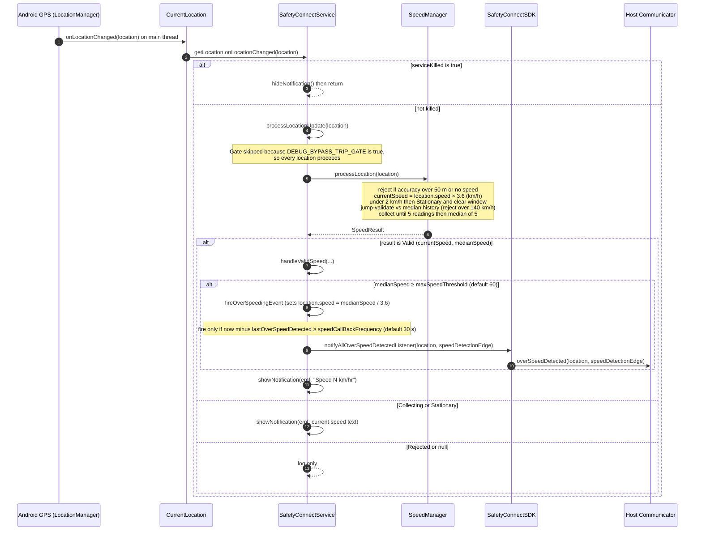

# Current Overspeed Sequence Diagram

> Extracted from `CURRENT_IMPLEMENTATION.md` (§4–§5). Describes the **current**
> behaviour only, as of `main`. No proposals or redesign.

## GPS fix to overspeed callback

## Key facts (as implemented)

- **Speed input:** Android GPS `location.speed` (m/s), converted to km/h via `×18/5` (2 dp). The SDK does not compute the reported speed from coordinates.
- **Smoothing:** median of the last **5** accepted km/h readings (`SpeedManager`).
- **Decision:** `medianSpeed` at or above `maxSpeedThreshold` (default **60 km/h**).
- **Throttle:** `speedCallBackFrequency` (default **30000 ms**); `lastOverSpeedDetected` is reset on every `onStartCommand`.
- **Stationary cutoff:** `stationarySpeedKmh` (default **2 km/h**) produces `Stationary`, which clears `locationHistory` and `speedReadings`.
- **Trip gate:** implemented (`TripGate.isDriving`) but **bypassed** in the current tree (`DEBUG_BYPASS_TRIP_GATE = true`).
- **Network:** none in this path — overspeed is fully on-device.

**Call chain:** `CurrentLocation.onLocationChanged` to `SafetyConnectService.processLocationUpdate` to `SpeedManager.processLocation` to `SafetyConnectService.handleValidSpeed` to `fireOverSpeedingEvent` to `SafetyConnectSDK.notifyAllOverSpeedDetectedListener` to `SafetyConnectCommunicator.overSpeedDetected`.
