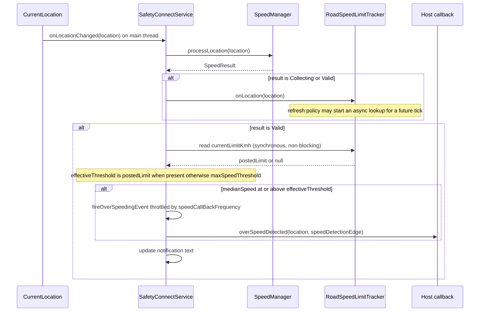
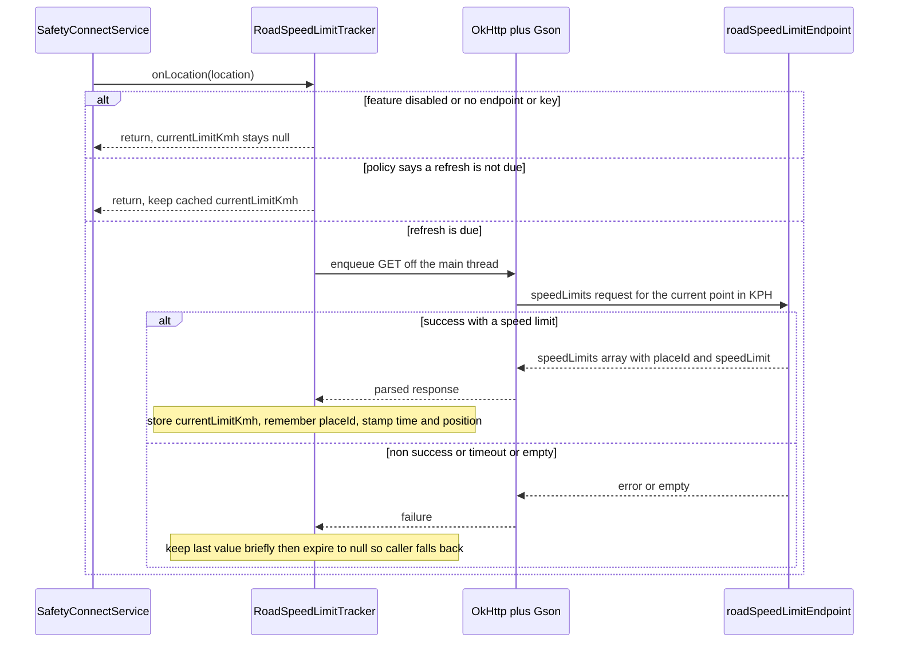

# RFC — Context-Aware Road Speed Limits (BRD F2.1)

> **Status:** Proposed (re-derived from first principles, Session 3).
> **Supersedes:** the earlier draft `docs/rfc/road-aware-speed-limits.md` (6-component
> design), removed in the lean-operating-model migration and retained only in git
> history. That draft is treated here as non-authoritative; nothing below assumes any
> of its decisions.
> **Derived only from:** `CURRENT_IMPLEMENTATION.md`, `REFERENCE_IMPLEMENTATION.md`,
> `docs/BRD.md`, the current SDK source tree (`safetyconnect/src/...`), and Google's
> current Roads API documentation (see §5 and the provenance note there).
> **Design objective:** the *smallest* production-ready change that makes the overspeed
> decision respect the posted road limit, with a fail-safe fallback to today's behaviour.
> **Symbols** (class / method / field names) are the stable anchors; line numbers drift.

---

## 0. Summary

Today the overspeed decision compares the driver's median GPS speed against a single
fixed number (`SensorFilters.maxSpeedThreshold`, default 60 km/h) at exactly one place —
`SafetyConnectService.handleValidSpeed`. BRD **F2.1 (Context-aware speed limits via map
API)** requires comparing against the **posted limit of the road actually being driven**,
to cut the false-positive overspeed alerts that are the program's central problem.

The minimum change is **one new class** — `RoadSpeedLimitTracker` — that resolves the
posted limit asynchronously (off the main thread, reusing the SDK's existing
OkHttp/Gson stack), caches it in a single volatile field, and is read **synchronously**
at the one decision site. The comparand becomes `roadLimit ?: maxSpeedThreshold`.

The design is **fail-safe**: whenever the limit is unknown, stale, disabled, unlicensed,
or the network fails, the tracker returns `null` and the decision falls back to the exact
behaviour shipping today. Enabling the feature can therefore only *reduce* false
positives on roads whose posted limit exceeds the fixed threshold — it can never regress
below the current baseline. That property is what lets the feature ship behind a
default-off flag before the (sales-gated) Google licence is in hand.

**Headline external constraint:** Google's Speed Limits endpoint still requires an
**Asset Tracking licence** in 2026 and its API key **cannot be restricted to an Android
app**. Both facts push the licensed call **off the device and behind a backend proxy**
for production. The SDK is therefore designed to be endpoint-agnostic (Google directly
for dev/eval, a host proxy for production) with a single response contract.

---

## 1. Gap Analysis (Current Implementation → Required Capability)

**Required capability (BRD F2.1):** at the moment an overspeed decision is made, compare
the measured speed against the *posted limit of the current road segment* rather than a
fixed threshold; fall back to the fixed threshold when the posted limit is unavailable.

**Current decision (verbatim), `SafetyConnectService.handleValidSpeed`:**

```
if ((SafetyConnectSDK.sensorFilters?.maxSpeedThreshold ?: 0f) <= medianSpeed) {
    fireOverSpeedingEvent(location.apply { speed = medianSpeed / 3.6f })
}
```

| # | Required | Current state (source fact) | Gap |
|---|----------|------------------------------|-----|
| **G1** | A source of the posted road limit for a location | The SDK holds **no map/road data of any kind**; nothing knows any road's limit. | No limit source exists. |
| **G2** | An outbound lookup for that limit | The speed path is **fully on-device**; the only network user is the crash pipeline (`NetworkModule`, host `api.example.com`) — a different host, unrelated flow. | No network on the speed path. |
| **G3** | The comparand to be the road limit when known | The comparand is the hardcoded `maxSpeedThreshold` at one site (`handleValidSpeed`). | Comparand is a constant. |
| **G4** | Config to enable the feature and supply key/endpoint | `SensorFilters` has no road-limit fields, and `initializeSensorFilter` copies only a **fixed field list** — any new field silently keeps its default (WATCHPOINT 3). | No config + a copy-list trap. |
| **G5** | The limit available synchronously at decision time | Locations are delivered on the **main thread**, so `handleValidSpeed` runs on the main thread; a blocking network call there is not acceptable. | Async data vs. a synchronous, main-thread decision. |
| **G6** | Correct behaviour when the limit is unknown | There is no notion of "limit unavailable"; the code always has a number. | No fallback / degradation path. |

Every proposed change in §2–§7 traces back to one or more of **G1–G6**. Nothing else in
the SDK is a gap for this capability, so nothing else is touched.

---

## 2. Proposed Architecture

### 2.1 One new component, one changed decision

```
                       reads posted limit (synchronous, non-blocking)
   SafetyConnectService.handleValidSpeed  ------------------------------.
        |  (unchanged: median speed, Valid path, throttle, callback)     |
        |  feeds accepted moving fixes                                   v
        '----------------------------->  RoadSpeedLimitTracker  (NEW, 1 class)
                                              |  refresh policy gate (time / distance / heading / placeId)
                                              |  async resolve OFF the main thread
                                              v
                                     reused OkHttp + Gson  --->  roadSpeedLimitEndpoint
                                     (dedicated short-timeout client)   (default: Google Roads
                                                                         Speed Limits; prod: host proxy)
```

- **Async-resolve / sync-read.** The tracker is *fed* each accepted, moving location and
  decides — per a refresh policy — whether to launch a background lookup. The lookup
  updates a single `@Volatile var currentLimitKmh: Float?`. `handleValidSpeed` only ever
  **reads** that field; it never blocks. (Solves G5.)
- **Comparand change (the whole behavioural change).** `handleValidSpeed` computes
  `effectiveThreshold = currentLimitKmh ?: maxSpeedThreshold` and keeps the existing
  comparison, throttle, event payload, and callback exactly as-is. (Solves G3, G6.)
- **Endpoint-agnostic.** The tracker calls a configured `roadSpeedLimitEndpoint`. Default
  is Google's Speed Limits URL (dev/eval, licensed key). In production the host points it
  at a **backend proxy** that holds the licensed, IP-restricted key server-side and
  mirrors the Google response shape, so the SDK has one parser regardless. (Solves G1, G2;
  see §8 for why the proxy is the recommended posture.)
- **Reuse, not rebuild.** OkHttp, Gson, Retrofit, and `play-services-location` are already
  dependencies; `INTERNET` is already declared (for the crash pipeline). The tracker
  reuses the OkHttp library and Gson — but with its **own** short-timeout client, because
  the crash client attaches a global `Authorization: Basic test:test` header and 60 s
  timeouts (see §8.9), neither of which is appropriate for a real-time roadside lookup.

### 2.2 What does *not* change

`SpeedManager` (on-device speed math), `CurrentLocation` (GPS source), `TripGate`, the
`NetworkModule` crash client, the `SafetyConnectCommunicator` callback interface, the
notification, and the manifest are **all untouched**. TripGate is explicitly out of scope
and the design has **no dependency on `DEBUG_BYPASS_TRIP_GATE`** — the comparand swap is
orthogonal to the gate and behaves identically whether the gate is active or bypassed.

---

## 3. Component Responsibilities

### 3.1 `RoadSpeedLimitTracker` (the only new class)

| Responsibility | Detail |
|---|---|
| (a) Accept location | `onLocation(location: Location)` — called from the service on accepted, **moving** fixes only (Collecting + Valid), never when Stationary/Rejected. |
| (b) Gate refreshes | Apply the refresh policy (§6.2) to decide whether this fix warrants a new lookup — bounds cost/quota. |
| (c) Resolve async | Build the request to `roadSpeedLimitEndpoint` and execute it **off the main thread** (OkHttp `enqueue`), parse with Gson. |
| (d) Cache | Hold `@Volatile currentLimitKmh: Float?`, the last snapped `placeId`, and last-refresh position/time. |
| (e) Sync read | Expose `currentLimitKmh` for a non-blocking read at the decision site. |
| (f) Degrade | On disabled / unknown / stale / non-200 / timeout, keep `currentLimitKmh == null` (or expire to null) so the caller falls back to the fixed threshold. |
| (g) Lifecycle | `clear()` to reset state; created and cleared with the rest of the speed subsystem. |

### 3.2 Per-change justification (why required · can existing do it · impact if omitted)

**New class `RoadSpeedLimitTracker`** — *required by G1, G2, G5, G6.*
- **Can an existing component do it?** No. `SpeedManager` is deliberately network-free and
  single-purpose (GPS→speed); adding network, caching, and a refresh policy there would
  couple two concerns and break its testability. `SafetyConnectService` could hold a
  volatile field and a method, but it is already the largest class and would then own
  network + cache + policy state inline — untestable and against the grain of the existing
  "one detector per concern" structure. `NetworkModule` is a Retrofit factory for the crash
  backend, not a place for road logic.
- **Impact if omitted:** there is no home for the async lookup or the synchronously-readable
  limit; the feature cannot exist without blocking the main thread.

**Modify `handleValidSpeed` (and feed from `handleCollectingSpeed`)** — *required by G3, G6.*
- **Existing?** This *is* the decision site; the change belongs here and only here.
- **Impact if omitted:** the comparand stays fixed — no feature.

**Add `SensorFilters` fields + extend the `initializeSensorFilter` copy-list** — *required by G4.*
- **Existing?** Reuses the single global config object; only new fields are added.
- **Impact if omitted:** the feature cannot be enabled or pointed at a key/proxy; and per
  the copy-list trap, fields added to `SensorFilters` **but not** to the copy block stay at
  their defaults — the feature would appear wired yet never activate.

**Add minimal response DTO(s) for Gson** — *required by G1.*
- **Existing?** No model matches the Roads response; a typed parse is the maintainable option.
- **Impact if omitted:** either hand-rolled JSON parsing (less maintainable) or no parse.

### 3.3 Components explicitly removed / not introduced

The task calls for the fewest classes and for removing anything of little architectural
value. Each of the following was considered and rejected, with the reason and the impact
of adding it:

| Rejected | Why rejected | Impact if added anyway |
|---|---|---|
| A `Road` / `RoadSegment` domain type | Google's `placeId` (a `String`) already *is* the road-segment identity. | Extra type, zero behavioural value. |
| A separate `RefreshPolicy` / strategy class | The policy is a handful of constants + one predicate, used at exactly one call site (like `SpeedManager`'s companion constants). | Indirection with no reuse or test benefit. |
| A new Retrofit `RoadsApiService` interface / network module | A single GET folds into the tracker via reused OkHttp + Gson. | Another interface + wiring for one call. |
| Fused-location migration / `CurrentLocation` changes | `handleValidSpeed` already has the `Location` (lat/lng); the provider is irrelevant to this feature. | Scope creep into an unrelated seam. |
| Any `SpeedManager` change | Its responsibility (speed math) is unchanged; the limit is a *comparand*, not a speed. | SRP violation, network in a network-free class. |
| A `SafetyConnectCommunicator` change (e.g., pass the posted limit to the host) | The overspeed *event* is unchanged; only the *decision threshold* changes. | Public-API change for no required capability. (Noted as an optional future extension.) |
| On-device persistence / disk cache of limits | In-memory volatile suffices within a continuous trip; cross-trip/cross-user caching belongs in the backend proxy. | Storage + invalidation complexity for marginal gain. |

---

## 4. Sequence Diagrams

Diagram text avoids the tokens that break GitHub's Mermaid renderer (WATCHPOINT 6): no
semicolons, no less-or-equal / greater-or-equal glyphs, no pipes, no braces, no line-break
tags.

### 4.1 Location to overspeed decision (with road limit and fallback)



### 4.2 Async refresh lifecycle inside the tracker



---

## 5. API Changes

### 5.1 External — Google Roads Speed Limits (the reference contract)

> **Provenance note.** The research environment's egress blocked `developers.google.com`,
> so the facts below were verified through Google's live search index of those exact pages
> and cross-checked, not by directly fetching the pages. Structural facts (endpoint,
> parameters, response schema, the licensing gate, the key-restriction constraint) are
> solid. Items marked **[VERIFY LIVE]** — exact prices, exact per-minute quota, the precise
> "billed as two SKUs" wording, and the licence cost — should be confirmed on an
> unrestricted network before the cost model is finalised.

**Endpoint (read-only GET):**

```
GET https://roads.googleapis.com/v1/speedLimits?path=LAT,LNG&units=KPH&key=API_KEY
```

- `path` — up to **100** `lat,lng` points (pipe-separated). Supplying `path` snaps to the
  travelled road and returns that segment's limit; the response then also carries
  `snappedPoints`. For this feature a **single current point** is sufficient.
- `placeId` — alternative to `path`; up to **100** repeated place IDs. Cheaper per call
  (see billing), but requires a prior snap to obtain the ID.
- `units` — `KPH` or `MPH`, **default `KPH`**. The SDK requests **KPH** so the returned
  number is already in the SDK's unit (km/h) — no conversion.
- `key` — API key (required).

**Response shape used by the SDK:**

```json
{
  "speedLimits": [
    { "placeId": "ChIJX12duJAwGQ0Ra0d4Oi4jOGE", "speedLimit": 105, "units": "KPH" }
  ],
  "snappedPoints": [
    { "location": { "latitude": 38.7580, "longitude": -9.0374 }, "originalIndex": 0, "placeId": "ChIJX12duJAwGQ0Ra0d4Oi4jOGE" }
  ]
}
```

The SDK reads `speedLimits[0].speedLimit` (the km/h number) and `speedLimits[0].placeId`
(segment identity for the stability backoff). `snappedPoints` is not needed. (Numeric
values above are illustrative — **[VERIFY LIVE]**.)

**Licensing gate (feasibility blocker):** Speed Limits is **"available to all customers
with an Asset Tracking licence."** A plain pay-as-you-go key does **not** unlock it; access
is a **sales-negotiated** commercial licence (indicative ~$10k/yr, quote-based —
**[VERIFY LIVE]**), with lead time. This is a business dependency, not a code one.

**Cost-relevant facts:** a `path`-based Speed Limits request is billed on the Speed-Limits
SKU **and** (per the documented model) the Route-Traveled SKU, whereas a `placeId`-based
request incurs only the Speed-Limits SKU (**[VERIFY LIVE]** on the exact wording).
`snapToRoads` and `nearestRoads` are **standard pay-as-you-go (no Asset Tracking licence)**
and both return a segment `placeId` — i.e., segment identity is obtainable without the
licence. 100 points/request cap across all three endpoints; a shared per-minute quota
(~30,000/min — **[VERIFY LIVE]**). The $200 monthly credit was removed on 2025-03-01 in
favour of per-SKU free monthly volumes.

### 5.2 Internal — SDK surface changes

- **`SensorFilters` (new fields):** `isRoadSpeedLimitEnabled: Boolean? = false`,
  `roadSpeedLimitEndpoint: String? = null`, `roadsApiKey: String? = null`,
  `speedLimitToleranceKmh: Float? = 0f` (optional; see §6).
- **`SafetyConnectService`:** `handleValidSpeed` computes the effective threshold and reads
  the tracker; `handleCollectingSpeed` and `handleValidSpeed` feed `tracker.onLocation(...)`;
  `startSpeedService` constructs the tracker (gated); `cleanup` clears/nulls it. No
  signature changes to the class's public surface.
- **New DTOs (Gson):** two small data classes, e.g.
  `RoadSpeedLimitsResponse(speedLimits: List<RoadSpeedLimitEntry>?)` and
  `RoadSpeedLimitEntry(placeId: String?, speedLimit: Double?, units: String?)`.
- **No change** to `SafetyConnectCommunicator`, `ApiService`, `NetworkModule`,
  `SpeedManager`, `CurrentLocation`, `TripGate`, or the manifest.

---

## 6. Configuration Changes

### 6.1 New `SensorFilters` fields

| Field | Default | Meaning | Notes |
|---|---|---|---|
| `isRoadSpeedLimitEnabled` | `false` | Master feature flag. | Off means the tracker is never constructed — zero behavioural change and zero network. |
| `roadSpeedLimitEndpoint` | `null` | Base URL for the lookup. | `null` while enabled means "use the Google default"; set to the host proxy URL in production. |
| `roadsApiKey` | `null` | API key appended when calling Google directly. | A proxy deployment can ignore/hold this server-side. |
| `speedLimitToleranceKmh` | `0f` | Fire only when median is at or above `postedLimit + tolerance`. | `0f` preserves current strictness; a small positive value further cuts boundary false positives (recommended, fleet-tunable). |

**Copy-list requirement (WATCHPOINT 3 — do not skip):** each new field **must** be added to
the field-by-field copy block in `SafetyConnectSDK.initializeSensorFilter`. Fields present
on `SensorFilters` but absent from that block silently retain their defaults, so the
feature would look configured yet never enable. This is a required part of the change, not
an optional nicety.

### 6.2 Refresh-policy constants (in the tracker, not config)

Kept as in-class constants (mirroring `SpeedManager`'s companion constants) to keep the
public config surface minimal. Indicative starting values, to be tuned during validation:

- **Time cadence** ~15 s between lookups (matches the ~5-reading cadence to reach `Valid`).
- **Minimum-distance floor** ~120 m — do not look up again until the vehicle has moved.
- **Heading-change trigger** ~45 deg — refresh early on a likely turn/exit (new segment).
- **placeId-stability backoff** — if the new response's `placeId` equals the last, keep the
  cached limit and extend the interval (still the same segment).
- **Staleness cap** — if no successful refresh within a bounded time/distance, expire
  `currentLimitKmh` to `null` so the decision falls back to the fixed threshold.
- Stationary fixes are never fed, so a parked vehicle makes no calls.

---

## 7. File-by-File Change Inventory

**New files**

| File | Contents | Approx size |
|---|---|---|
| `foreground/speed/RoadSpeedLimitTracker.kt` | The tracker: `onLocation`, `currentLimitKmh`, `clear`, the private refresh policy, the OkHttp `enqueue` + Gson parse, its dedicated short-timeout client. | ~120–160 LOC |
| `foreground/speed/RoadSpeedLimitModels.kt` | The two Gson DTOs (may instead be nested inside the tracker to reduce files). | ~10–15 LOC |

**Modified files**

| File | Change | Gap |
|---|---|---|
| `foreground/SafetyConnectService.kt` | `handleValidSpeed`: effective-threshold read + tolerance; feed `onLocation` from `handleCollectingSpeed` and `handleValidSpeed`; construct tracker in `startSpeedService` (gated on `isSpeedDetectionEnabled && isRoadSpeedLimitEnabled`); `clear()` it in `cleanup`; one field `roadSpeedLimitTracker`. | G3, G5, G6 |
| `SafetyConnectSDK.kt` | Add the four `SensorFilters` fields; add the same four to the `initializeSensorFilter` copy-list. | G4 |

**Explicitly unchanged** (stated so reviewers can confirm scope): `SpeedManager.kt`,
`CurrentLocation.kt`, `foreground/activity/TripGate.kt`, `network/NetworkModule.kt`,
`service/ApiService.kt`, `SafetyConnectCommunicator`, and
`safetyconnect/src/main/AndroidManifest.xml` (`INTERNET` already declared; no new
permission). No dependency on `DEBUG_BYPASS_TRIP_GATE`.

Net: **2 new files, 2 modified files, ~1 changed decision expression.**

---

## 8. Risks and Trade-offs

1. **Licensing gate (feasibility blocker).** Speed Limits needs a sales-gated Asset
   Tracking licence; it cannot ship on a self-serve key. *Mitigation:* the feature is
   default-off and fail-safe, so it can be built, merged, and shipped dark now, and enabled
   only once the licence is secured — no code rework in between. **Decision/procurement
   dependency, tracked separately.**
2. **Key security — the Roads key cannot be Android-restricted.** It is a web-service key
   (IP restriction only, which a mobile client cannot satisfy). An embedded key is
   harvestable and billable, and the licensed key must never sit on-device. *Mitigation
   (recommended production posture):* route through a **backend proxy** that holds the
   IP-restricted key server-side, speaks the Google contract, and can cache
   `placeId → limit` across users/trips. The SDK supports this today via
   `roadSpeedLimitEndpoint`; direct-to-Google is for dev/eval only. **The proxy is a
   backend deliverable owned outside the SDK.**
3. **Cost / quota.** Every lookup is billable, and `path`-based calls bill two SKUs.
   *Mitigation:* the refresh policy (time + distance + heading + placeId-stability) bounds
   call volume; the proxy's cross-user cache amortises further; a daily quota cap guards
   spend. Exact prices/quota are **[VERIFY LIVE]**.
4. **Staleness / lag.** The posted limit lags position by up to one refresh cycle.
   *Mitigation:* the median speed is already smoothed over ~5 readings (~10 s), so the
   decision is not instantaneous either; the heading-change trigger catches segment
   changes; on a continuous road adjacent segments usually share a limit; worst case is a
   fallback to the fixed threshold. Acceptable for an alerting (not enforcement) feature.
5. **Privacy.** The feature sends live coordinates to Google (or the proxy). The crash
   pipeline already transmits sensor data to a backend, but Google is a third party — call
   this out in the privacy review; the proxy posture keeps coordinates within
   host-controlled infrastructure.
6. **Reliability.** Network failures/timeouts must never stall the main-thread decision.
   *Mitigation:* async `enqueue` only, a short dedicated timeout, and null-on-failure
   fallback; the tracker's own client isolates Roads failures from the crash client.
7. **placeId longevity.** Place IDs are storable but can change (~12-month refresh
   guidance). Mostly a proxy-cache concern (invalidate on refresh), not an on-device one.
8. **Alternative to de-risk the licence — Navigation SDK.** Google's Navigation SDK for
   Android exposes a built-in speed-limit/speedometer with over-limit alerts and may avoid
   the separate Speed Limits licence, at the cost of adopting a different premium mobility
   product and a heavier integration. Worth a feasibility spike as plan B if the Asset
   Tracking licence proves impractical; it does not change the SDK-side seam (still a
   posted-limit source feeding the same comparand).
9. **Reused-client caveat.** The crash `OkHttpClient` injects a global
   `Authorization: Basic test:test` header and uses 60 s timeouts — unsuitable here. The
   tracker therefore reuses the OkHttp *library* with its **own** short-timeout client and
   no injected auth header. (Minor: the project's pinned OkHttp is old; the tracker sticks
   to long-stable APIs — `connectTimeout`/`readTimeout`/`enqueue`.)
10. **Thread-safety.** `currentLimitKmh` is written on a network thread and read on the
    main thread; it is a single `@Volatile Float?`, so the read is atomic and lock-free.

---

## 9. Why This Is the Minimum Viable Production Design

- **Smallest surface that satisfies F2.1.** One new class, two new fields' worth of config
  (plus the mandatory copy-list line), two small DTOs, and one changed decision
  expression. 2 new files, 2 modified files.
- **Every change is gap-justified.** Each item in §2–§7 maps to a specific gap in §1;
  nothing is added "for elegance." The prior draft's extra components (a road domain type,
  a separate policy/strategy, a bespoke network module, provider changes) are explicitly
  removed because none carries architectural value at this one call site.
- **Maximum reuse.** OkHttp, Gson, Retrofit, `play-services-location`, the `Manager` pool,
  `CurrentLocation`, and the single global `SensorFilters` are all reused; `INTERNET` is
  already present. The only deliberate non-reuse (a dedicated HTTP client) is a
  *correctness* choice, justified in §8.9.
- **Fail-safe by construction.** Unknown / stale / disabled / unlicensed / failed all
  collapse to `currentLimitKmh == null` and the existing fixed-threshold path. The feature
  cannot regress the current baseline; it can only remove false positives on higher-limit
  roads — which is exactly the BRD's intent.
- **Production-ready boundaries are explicit.** The licensing gate and the key-restriction
  reality are surfaced as first-class risks with a concrete posture (default-off flag now;
  backend proxy for the licensed key in production), so "production-ready" means *ready to
  ship dark and switch on when the licence and proxy land* — not "ready to embed a licensed
  key in the APK."
- **Correctness and maintainability over cleverness.** The decision stays at its single
  historical site; the speed math, GPS source, trip gate, crash pipeline, and host callback
  contract are untouched; and the design has no dependency on the `DEBUG_BYPASS_TRIP_GATE`
  debug state.

---

## Appendix — Open verification items (carry to office / an unrestricted network)

These do not change the architecture, only the cost model and copy accuracy:

1. Exact per-1,000 prices for the Roads and Speed-Limits SKUs.
2. The precise "path Speed Limits is billed as Route-Traveled + Speed-Limits" wording.
3. The exact shared per-minute quota figure.
4. The current Asset Tracking licence cost and onboarding lead time.
5. Whether the Navigation SDK speed-limit path is commercially preferable to the Asset
   Tracking licence for this fleet.
