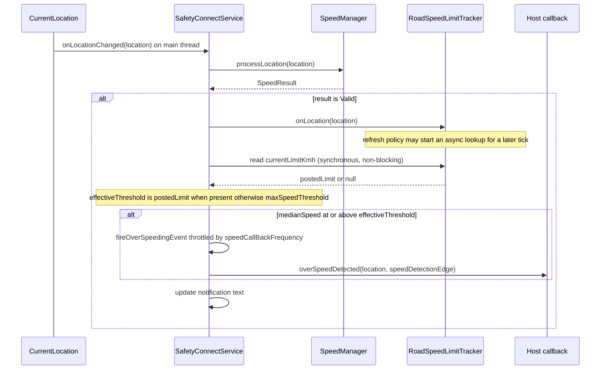
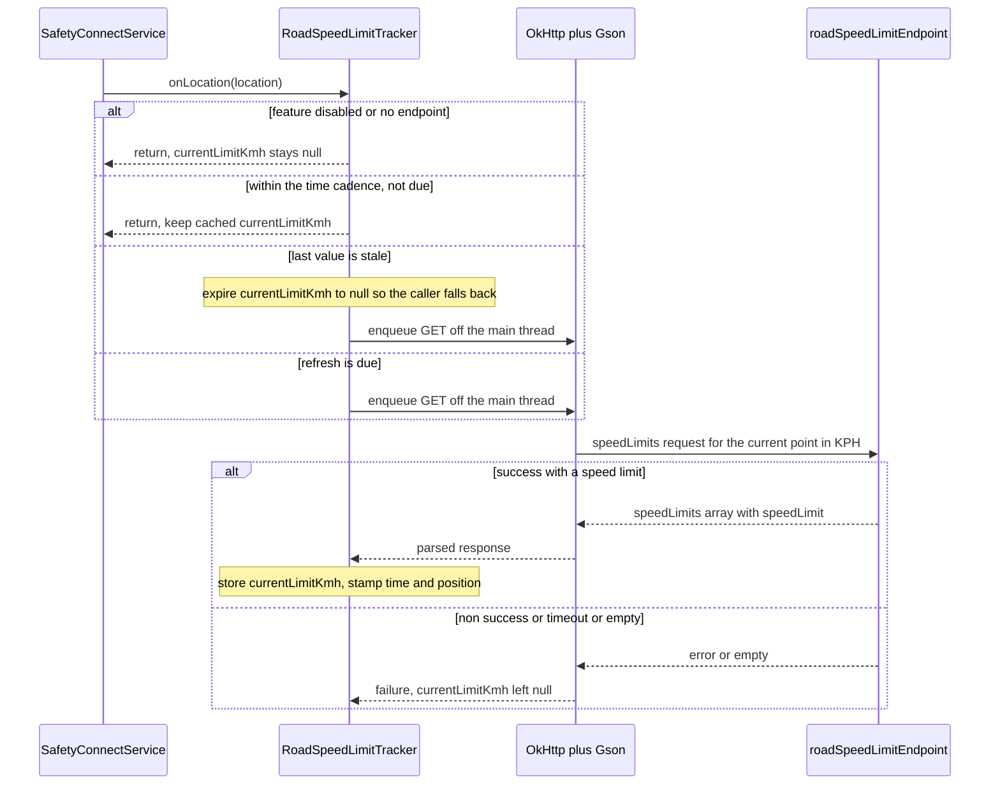

# RFC — Context-Aware Road Speed Limits (BRD F2.1)

> **Status:** Proposed (re-derived from first principles, Session 3).
> **Supersedes:** the earlier draft `docs/rfc/road-aware-speed-limits.md` (6-component
> design), removed in the lean-operating-model migration and retained only in git
> history. That draft is treated here as non-authoritative; nothing below assumes any
> of its decisions.
> **Derived only from:** `CURRENT_IMPLEMENTATION.md`, `REFERENCE_IMPLEMENTATION.md`,
> `docs/BRD.md`, the current SDK source tree (`safetyconnect/src/...`), and Google's
> current Roads API documentation (see §5 and the provenance note there).
> **Design objective:** the *smallest* production-ready change that makes the overspeed
> decision respect the posted road limit, with a fail-safe fallback to today's behaviour.
> **Symbols** (class / method / field names) are the stable anchors; line numbers drift.

---

## 0. Summary

Today the overspeed decision compares the driver's median GPS speed against a single
fixed number (`SensorFilters.maxSpeedThreshold`, default 60 km/h) at exactly one place —
`SafetyConnectService.handleValidSpeed`. BRD **F2.1 (Context-aware speed limits via map
API)** requires comparing against the **posted limit of the road actually being driven**,
to cut the false-positive overspeed alerts that are the program's central problem.

The minimum change is **one new class** — `RoadSpeedLimitTracker` — that resolves the
posted limit asynchronously (off the main thread, reusing the SDK's existing
OkHttp/Gson stack), caches it in a single volatile field, and is read **synchronously**
at the one decision site. The comparand becomes `roadLimit ?: maxSpeedThreshold`.

The design is **fail-safe**: whenever the limit is unknown, stale, disabled, unlicensed,
or the network fails, the tracker returns `null` and the decision falls back to the exact
behaviour shipping today. Enabling the feature can therefore only *reduce* false
positives on roads whose posted limit exceeds the fixed threshold — it can never regress
below the current baseline. (That guarantee depends on the **staleness cap** of §6.2; see
§8.4 for why it is mandatory, not optional.) The property is what lets the feature ship
behind a default-off flag before the (sales-gated) Google licence is in hand.

**Headline external constraint:** Google's Speed Limits endpoint still requires an
**Asset Tracking licence** in 2026 and its API key **cannot be restricted to an Android
app**. Both facts push the licensed call **off the device and behind a backend proxy**
for production. The SDK therefore calls **one configured endpoint** — the host proxy in
production, Google directly only for dev — with a single response contract.

---

## 1. Gap Analysis (Current Implementation → Required Capability)

**Required capability (BRD F2.1):** at the moment an overspeed decision is made, compare
the measured speed against the *posted limit of the current road segment* rather than a
fixed threshold; fall back to the fixed threshold when the posted limit is unavailable.

**Current decision (verbatim), `SafetyConnectService.handleValidSpeed`:**

```
if ((SafetyConnectSDK.sensorFilters?.maxSpeedThreshold ?: 0f) <= medianSpeed) {
    fireOverSpeedingEvent(location.apply { speed = medianSpeed / 3.6f })
}
```

| # | Required | Current state (source fact) | Gap |
|---|----------|------------------------------|-----|
| **G1** | A source of the posted road limit for a location | The SDK holds **no map/road data of any kind**; nothing knows any road's limit. | No limit source exists. |
| **G2** | An outbound lookup for that limit | The speed path is **fully on-device**; the only network user is the crash pipeline (`NetworkModule`, host `api.example.com`) — a different host, unrelated flow. | No network on the speed path. |
| **G3** | The comparand to be the road limit when known | The comparand is the hardcoded `maxSpeedThreshold` at one site (`handleValidSpeed`). | Comparand is a constant. |
| **G4** | Config to enable the feature and point it at an endpoint | `SensorFilters` has no road-limit fields, and `initializeSensorFilter` copies only a **fixed field list** — any new field silently keeps its default (WATCHPOINT 3). | No config + a copy-list trap. |
| **G5** | The limit available synchronously at decision time | Locations are delivered on the **main thread**, so `handleValidSpeed` runs on the main thread; a blocking network call there is not acceptable. | Async data vs. a synchronous, main-thread decision. |
| **G6** | Correct behaviour when the limit is unknown or stale | There is no notion of "limit unavailable"; the code always has a number. | No fallback / degradation path. |

Every proposed change in §2–§7 traces back to one or more of **G1–G6**. Nothing else in
the SDK is a gap for this capability, so nothing else is touched.

---

## 2. Proposed Architecture

### 2.1 One new component, one changed decision

```
                       reads posted limit (synchronous, non-blocking)
   SafetyConnectService.handleValidSpeed  ------------------------------.
        |  (unchanged: median speed, Valid path, throttle, callback)     |
        |  feeds accepted Valid fixes                                    v
        '----------------------------->  RoadSpeedLimitTracker  (NEW, 1 class)
                                              |  refresh policy (time cadence plus staleness expiry)
                                              |  async resolve OFF the main thread
                                              v
                                     reused OkHttp plus Gson  --->  roadSpeedLimitEndpoint
                                     (dedicated short-timeout client)   (host proxy in prod;
                                                                         Google direct for dev)
```

- **Async-resolve / sync-read.** The tracker is *fed* each accepted `Valid` location and
  decides — per the refresh policy — whether to launch a background lookup. The lookup
  updates a single `@Volatile var currentLimitKmh: Float?`. `handleValidSpeed` only ever
  **reads** that field; it never blocks. (Solves G5.)
- **Comparand change (the whole behavioural change).** `handleValidSpeed` computes
  `effectiveThreshold = currentLimitKmh ?: maxSpeedThreshold` and keeps the existing
  comparison, throttle, event payload, and callback exactly as-is. (Solves G3, G6.)
- **One configured endpoint.** The tracker calls `roadSpeedLimitEndpoint`: in production
  the host's **backend proxy** (holding the licensed, IP-restricted key server-side and
  mirroring the Google response shape); for dev, Google directly with the key baked into
  the URL. One parser regardless. If the feature flag is on but no endpoint is set, the
  tracker is not constructed and the feature stays off (fail-safe). (Solves G1, G2; see §8
  for the proxy rationale.)
- **Reuse, not rebuild.** OkHttp and Gson are already dependencies; `INTERNET` is already
  declared (for the crash pipeline). The tracker reuses the OkHttp library and Gson — but
  with its **own** short-timeout client, because the crash client attaches a global
  `Authorization: Basic test:test` header and 60 s timeouts (see §8.9), neither of which is
  appropriate for a real-time roadside lookup.

### 2.2 What does *not* change

`SpeedManager` (on-device speed math), `CurrentLocation` (GPS source), `TripGate`, the
`NetworkModule` crash client, the `SafetyConnectCommunicator` callback interface, the
notification, and the manifest are **all untouched**. TripGate is explicitly out of scope
and the design has **no dependency on `DEBUG_BYPASS_TRIP_GATE`** — the comparand swap is
orthogonal to the gate and behaves identically whether the gate is active or bypassed.

---

## 3. Component Responsibilities

### 3.1 `RoadSpeedLimitTracker` (the only new class)

| Responsibility | Detail |
|---|---|
| (a) Accept location | `onLocation(location: Location)` — called from the service on accepted **`Valid`** fixes (moving); never when Stationary/Rejected. |
| (b) Gate refreshes | Apply the refresh policy (§6.2) — a time-cadence gate — to decide whether this fix warrants a new lookup, bounding cost/quota. |
| (c) Resolve async | Build the request to `roadSpeedLimitEndpoint` and execute it **off the main thread** (OkHttp `enqueue`), parse with Gson. |
| (d) Cache | Hold `@Volatile currentLimitKmh: Float?` plus the last-refresh time and position. |
| (e) Sync read | Expose `currentLimitKmh` for a non-blocking read at the decision site. |
| (f) Degrade | On disabled / unknown / non-200 / timeout, keep `currentLimitKmh == null`; on staleness (§6.2) expire it to `null` — so the caller falls back to the fixed threshold. |
| (g) Lifecycle | `clear()` to reset state; created and cleared with the rest of the speed subsystem. |

### 3.2 Per-change justification (why required · can existing do it · impact if omitted)

**New class `RoadSpeedLimitTracker`** — *required by G1, G2, G5, G6.*
- **Can an existing component do it?** No. `SpeedManager` is deliberately network-free and
  single-purpose (GPS→speed); adding network, caching, and a refresh policy there would
  couple two concerns and break its testability. `SafetyConnectService` could hold a
  volatile field and a method, but it is already the largest class and would then own
  network + cache + policy state inline — untestable and against the grain of the existing
  "one detector per concern" structure. `NetworkModule` is a Retrofit factory for the crash
  backend, not a place for road logic.
- **Impact if omitted:** there is no home for the async lookup or the synchronously-readable
  limit; the feature cannot exist without blocking the main thread.

**Modify `handleValidSpeed`** — *required by G3, G6.*
- **Existing?** This *is* the decision site; the change belongs here and only here.
- **Impact if omitted:** the comparand stays fixed — no feature.

**Add two `SensorFilters` fields + extend the `initializeSensorFilter` copy-list** — *required by G4.*
- **Existing?** Reuses the single global config object; only new fields are added.
- **Impact if omitted:** the feature cannot be enabled or pointed at an endpoint; and per
  the copy-list trap, fields added to `SensorFilters` **but not** to the copy block stay at
  their defaults — the feature would appear wired yet never activate.

**Add minimal response DTO(s) for Gson** — *required by G1.*
- **Existing?** No model matches the Roads response; a typed parse is the maintainable option.
- **Impact if omitted:** either hand-rolled JSON parsing (less maintainable) or no parse.

### 3.3 Components explicitly removed / not introduced

The task calls for the fewest classes and for removing anything of little architectural
value. Each of the following was considered and rejected, with the reason and the impact
of adding it:

| Rejected | Why rejected | Impact if added anyway |
|---|---|---|
| A `Road` / `RoadSegment` domain type | Google's `placeId` (a `String`) already *is* the road-segment identity. | Extra type, zero behavioural value. |
| A separate `RefreshPolicy` / strategy class | The policy is two constants + one predicate, used at exactly one call site (like `SpeedManager`'s companion constants). | Indirection with no reuse or test benefit. |
| A new Retrofit `RoadsApiService` interface / network module | A single GET folds into the tracker via reused OkHttp + Gson. | Another interface + wiring for one call. |
| Fused-location migration / `CurrentLocation` changes | `handleValidSpeed` already has the `Location` (lat/lng); the provider is irrelevant to this feature. | Scope creep into an unrelated seam. |
| Any `SpeedManager` change | Its responsibility (speed math) is unchanged; the limit is a *comparand*, not a speed. | SRP violation, network in a network-free class. |
| A `SafetyConnectCommunicator` change (e.g., pass the posted limit to the host) | The overspeed *event* is unchanged; only the *decision threshold* changes. | Public-API change for no required capability. (Noted as an optional future extension.) |
| On-device persistence / disk cache of limits | In-memory volatile suffices within a continuous trip; cross-trip/cross-user caching belongs in the backend proxy. | Storage + invalidation complexity for marginal gain. |

### 3.4 Rejected alternative — mutating `maxSpeedThreshold` at runtime

A natural "even smaller" variant is to add no new state at all: keep the entire overspeed
pipeline as-is and simply **overwrite** `SafetyConnectSDK.sensorFilters.maxSpeedThreshold`
with the current road's limit as the vehicle changes segments, letting `handleValidSpeed`
compare against it unchanged. The field is `var Float?`, so the type permits it. It is
rejected for four code-grounded reasons.

- **Why it looks simpler.** It introduces zero new fields and reuses the one existing
  comparand slot, leaving `handleValidSpeed` seemingly untouched.
- **It breaks the fallback model.** `maxSpeedThreshold` is the **only stored copy** of the
  host-configured threshold (copied once in `initializeSensorFilter`, read only at
  `handleValidSpeed`). The fail-safe needs both the road limit *and* the configured default
  available at the same instant (`roadLimit ?: maxSpeedThreshold`). Overwriting the slot
  discards the configured default, so the next unmapped segment, dead zone, or failed
  lookup has no correct value to fall back to — forcing the original to be preserved
  elsewhere, which re-introduces (and enlarges) the very state the variant set out to
  remove. State is not reduced, only moved.
- **`null` cannot represent "unknown" here.** The decision reads
  `(maxSpeedThreshold ?: 0f) <= medianSpeed`. Setting the slot to `null` to signal "limit
  unknown" collapses to `0 <= medianSpeed`, firing on essentially every moving reading — a
  false-positive firehose, the opposite of the BRD goal. Representing "unknown" in this slot
  therefore also forces an edit to the decision site, defeating the "pipeline unchanged"
  premise. A dedicated `currentRoadLimit: Float?` uses `null` cleanly because the fallback
  expression, not `?: 0f`, interprets it.
- **Configuration vs. runtime state.** `maxSpeedThreshold` lives on the process-global,
  multi-reader `sensorFilters` and outlives any service instance; road context is per-trip
  and is cleared in `cleanup()`. The codebase already separates configuration
  (`SensorFilters`) from per-feature runtime state (`SpeedManager` owns speed state,
  `TripGate` owns `isDriving`). A `currentRoadLimit` field on the tracker follows that
  pattern and matches the road-context lifecycle; continuously writing the shared config
  field instead blurs "what the host set" with "what the road said" and turns a
  write-once-at-init value into a cross-thread, cross-lifecycle mutable — for no reduction
  in moving parts.

**Conclusion:** the chosen design (one nullable field, `currentRoadLimit ?: maxSpeedThreshold`)
is both smaller in real delta and safer — it keeps `maxSpeedThreshold` as the pristine,
always-available fallback, which is the entire point of the fail-safe.

### 3.5 Deferred to validation (explicitly not in the MVP)

To keep the first cut minimal, the following are consciously deferred. Each is an efficacy
or cost optimisation whose worst case is a **safe fallback**, not a correctness gap. They
are recorded here so they read as deliberate omissions, not oversights, and are revisited
during validation if measurements justify them.

- **`speedLimitToleranceKmh` (tolerance band).** F2.1 asks only to compare against the
  posted limit; a tolerance is orthogonal tuning (it could have been added to the fixed
  threshold years ago) and is a no-op at its default. Add only if boundary false positives
  show up in validation.
- **`roadsApiKey` as a distinct field.** Production authenticates at the proxy (server-side
  key); for dev the key is baked into `roadSpeedLimitEndpoint` (`.../speedLimits?key=…`) and
  the tracker still appends the `path`/`units` query parameters. A separate on-device key
  field only serves the explicitly-unsafe direct path.
- **Minimum-distance floor and heading-change trigger.** Refinements over the time cadence:
  a parked vehicle is already unfed (Stationary never calls `onLocation`), and a missed
  segment boundary degrades to the fixed-threshold fallback. Both add state / bearing math
  for efficacy, not correctness.
- **placeId-stability backoff.** A call-dedup optimisation that belongs in the proxy's
  cross-user cache (the settled production posture), not on-device; deferring it also keeps
  `placeId` out of the parsed DTO and removes the last-placeId state.
- **Collecting-phase warm-up feed.** Feeding `onLocation` during `Collecting` (before the
  5-reading window fills) buys ~10 s so the first `Valid` decision already has a limit.
  Cheap to add back; not required, since a null limit falls back safely.

---

## 4. Sequence Diagrams

Diagram text avoids the tokens that break GitHub's Mermaid renderer (WATCHPOINT 6): no
semicolons, no less-or-equal / greater-or-equal glyphs, no pipes, no braces, no line-break
tags.

### 4.1 Location to overspeed decision (with road limit and fallback)



### 4.2 Async refresh lifecycle inside the tracker



---

## 5. API Changes

### 5.1 External — Google Roads Speed Limits (the reference contract)

> **Provenance note.** The research environment's egress blocked `developers.google.com`,
> so the facts below were verified through Google's live search index of those exact pages
> and cross-checked, not by directly fetching the pages. Structural facts (endpoint,
> parameters, response schema, the licensing gate, the key-restriction constraint) are
> solid. Items marked **[VERIFY LIVE]** — exact prices, exact per-minute quota, the precise
> "billed as two SKUs" wording, and the licence cost — should be confirmed on an
> unrestricted network before the cost model is finalised.

**Endpoint (read-only GET):**

```
GET https://roads.googleapis.com/v1/speedLimits?path=LAT,LNG&units=KPH&key=API_KEY
```

- `path` — up to **100** `lat,lng` points (pipe-separated). Supplying `path` snaps to the
  travelled road and returns that segment's limit; the response then also carries
  `snappedPoints`. For this feature a **single current point** is sufficient.
- `placeId` — alternative to `path`; up to **100** repeated place IDs. Cheaper per call
  (see billing), but requires a prior snap to obtain the ID.
- `units` — `KPH` or `MPH`, **default `KPH`**. The SDK requests **KPH** so the returned
  number is already in the SDK's unit (km/h) — no conversion.
- `key` — API key (required; injected by the proxy in production).

**Response shape (Google contract):**

```json
{
  "speedLimits": [
    { "placeId": "ChIJX12duJAwGQ0Ra0d4Oi4jOGE", "speedLimit": 105, "units": "KPH" }
  ],
  "snappedPoints": [
    { "location": { "latitude": 38.7580, "longitude": -9.0374 }, "originalIndex": 0, "placeId": "ChIJX12duJAwGQ0Ra0d4Oi4jOGE" }
  ]
}
```

The SDK parses only `speedLimits[0].speedLimit` (the km/h number). `placeId` and `units`
are not parsed in the MVP (`units` is fixed to KPH by the request; `placeId` is only needed
by the deferred stability backoff, §3.5), and `snappedPoints` is ignored. (Numeric values
above are illustrative — **[VERIFY LIVE]**.)

**Licensing gate (feasibility blocker):** Speed Limits is **"available to all customers
with an Asset Tracking licence."** A plain pay-as-you-go key does **not** unlock it; access
is a **sales-negotiated** commercial licence (indicative ~$10k/yr, quote-based —
**[VERIFY LIVE]**), with lead time. This is a business dependency, not a code one.

**Cost-relevant facts:** a `path`-based Speed Limits request is billed on the Speed-Limits
SKU **and** (per the documented model) the Route-Traveled SKU, whereas a `placeId`-based
request incurs only the Speed-Limits SKU (**[VERIFY LIVE]** on the exact wording).
`snapToRoads` and `nearestRoads` are **standard pay-as-you-go (no Asset Tracking licence)**
and both return a segment `placeId` — i.e., segment identity is obtainable without the
licence. 100 points/request cap across all three endpoints; a shared per-minute quota
(~30,000/min — **[VERIFY LIVE]**). The $200 monthly credit was removed on 2025-03-01 in
favour of per-SKU free monthly volumes.

### 5.2 Internal — SDK surface changes

- **`SensorFilters` (two new fields):** `isRoadSpeedLimitEnabled: Boolean? = false` and
  `roadSpeedLimitEndpoint: String? = null`.
- **`SafetyConnectService`:** `handleValidSpeed` computes the effective threshold, feeds
  `tracker.onLocation(...)`, and reads `tracker.currentLimitKmh`; `startSpeedService`
  constructs the tracker (gated); `cleanup` clears/nulls it. No signature changes to the
  class's public surface.
- **New DTOs (Gson):** two small data classes —
  `RoadSpeedLimitsResponse(speedLimits: List<RoadSpeedLimitEntry>?)` and
  `RoadSpeedLimitEntry(speedLimit: Double?)`.
- **No change** to `SafetyConnectCommunicator`, `ApiService`, `NetworkModule`,
  `SpeedManager`, `CurrentLocation`, `TripGate`, or the manifest.

---

## 6. Configuration Changes

### 6.1 New `SensorFilters` fields

| Field | Default | Meaning | Notes |
|---|---|---|---|
| `isRoadSpeedLimitEnabled` | `false` | Master feature flag. | Off means the tracker is never constructed — zero behavioural change and zero network. Retained (rather than enabling purely on `endpoint != null`) for parity with the codebase's per-feature `is<Feature>Enabled` idiom. |
| `roadSpeedLimitEndpoint` | `null` | The lookup URL. | Set to the host **proxy** URL in production; for dev, Google's Speed Limits URL with the key in the query string. Flag on but endpoint `null` ⇒ feature stays off (fail-safe). |

Enabling therefore requires **both** `isRoadSpeedLimitEnabled == true` **and** a non-null
`roadSpeedLimitEndpoint` (mirroring how `isSpeedDetectionEnabled` plus a live provider gate
`CurrentLocation`).

**Copy-list requirement (WATCHPOINT 3 — do not skip):** each new field **must** be added to
the field-by-field copy block in `SafetyConnectSDK.initializeSensorFilter`. Fields present
on `SensorFilters` but absent from that block silently retain their defaults, so the
feature would look configured yet never enable. This is a required part of the change, not
an optional nicety.

### 6.2 Refresh policy (two rules, in-tracker constants)

The MVP policy is deliberately **two rules** — a rate gate and a fail-safe expiry — kept as
in-class constants (mirroring `SpeedManager`'s companion constants) so the public config
surface stays at the two fields above. Additional signals (distance floor, heading-change,
placeId-stability) are deferred (§3.5).

- **Time cadence (cost gate).** At most one lookup per ~15 s while moving (matches the
  ~5-reading cadence to reach `Valid`). Google's quota is per-minute, so a rate gate bounds
  the external constraint directly. Stationary fixes are never fed, so a parked vehicle
  makes no calls.
- **Staleness cap (the fail-safe — load-bearing).** Expire `currentLimitKmh` to `null` once
  the last successful lookup is older than a bounded window in **both time and distance**.
  This is what makes the "can never regress below baseline" guarantee *true*: without it, a
  stale high limit cached before a signal gap would suppress an alert that the fixed
  threshold would have fired (see §8.4). The expiry must be **specified and tested**, not
  left implicit.

### 6.3 Why a refresh policy at all — road identity is a paid network output

A reviewer may ask: why a time-based policy rather than simply refreshing when the road
(`placeId`) changes? Because **road identity is not observable on-device.** A `placeId` is
produced **server-side** by snapping GPS coordinates to Google's road graph; the device has
raw lat/lng/bearing but no road topology, so it cannot compute or detect a `placeId` change
locally. Every way to obtain a `placeId` is a billable Google call — `snapToRoads`,
`nearestRoads`, or `speedLimits?path=`. Therefore "the segment changed" is an **output** of
a call, not a **trigger** for one: to learn whether the road changed you must spend exactly
the call the trigger was meant to gate. That circularity is why an on-device heuristic —
time (optionally distance/heading) — is unavoidable to decide *when to spend a call*. **The
refresh policy exists because of a Google API constraint, not SDK architecture.**

`placeId`-change is the *ideal semantic* trigger but an *unobservable* one; its real use is
as **post-call feedback** to tune the next interval — the deferred placeId-stability backoff
(§3.5): keep the cached limit and back off while the returned `placeId` is unchanged,
refresh promptly when it differs. The deferred **heading-change** signal is the device's
best *local approximation* of "road probably changed" using only GPS.

**MVP request sequence (single call):**
1. GPS `lat,lng` arrives on the `Valid` path.
2. The on-device time cadence says a refresh is due.
3. `GET {endpoint}?path=lat,lng&units=KPH` → the server snaps to the road graph → returns
   `speedLimits[0].speedLimit` (and `placeId`, unused in the MVP).
4. Cache the limit; `handleValidSpeed` reads it synchronously.

The only step that reveals a road change is step 3 — the call itself. (A cost-reducing
two-tier variant belongs in the proxy: snap cheaply via `snapToRoads`/`nearestRoads` for the
`placeId`, and call the licensed `speedLimits?placeId=` **only when the id changes** — still
gated by an on-device cadence, and therefore still not a free trigger.) An offline on-device
road graph could make identity local, but that is a map-matching engine plus bundled map
data — a dependency far larger than the whole feature, and out of scope.

---

## 7. File-by-File Change Inventory

**New files**

| File | Contents | Approx size |
|---|---|---|
| `foreground/speed/RoadSpeedLimitTracker.kt` | The tracker: `onLocation`, `currentLimitKmh`, `clear`, the two-rule refresh policy, the OkHttp `enqueue` + Gson parse, its dedicated short-timeout client. | ~100–140 LOC |
| `foreground/speed/RoadSpeedLimitModels.kt` | The two Gson DTOs (may instead be nested inside the tracker to reduce files). | ~6–10 LOC |

**Modified files**

| File | Change | Gap |
|---|---|---|
| `foreground/SafetyConnectService.kt` | `handleValidSpeed`: `effectiveThreshold = currentLimitKmh ?: maxSpeedThreshold` (no tolerance) + feed `onLocation`; construct the tracker in `startSpeedService` (gated on `isSpeedDetectionEnabled == true && isRoadSpeedLimitEnabled == true && roadSpeedLimitEndpoint != null`); `clear()` it in `cleanup`; one field `roadSpeedLimitTracker`. | G3, G5, G6 |
| `SafetyConnectSDK.kt` | Add the two `SensorFilters` fields; add the same two to the `initializeSensorFilter` copy-list. | G4 |

**Explicitly unchanged** (stated so reviewers can confirm scope): `SpeedManager.kt`,
`CurrentLocation.kt`, `foreground/activity/TripGate.kt`, `network/NetworkModule.kt`,
`service/ApiService.kt`, `SafetyConnectCommunicator`, and
`safetyconnect/src/main/AndroidManifest.xml` (`INTERNET` already declared; no new
permission). No dependency on `DEBUG_BYPASS_TRIP_GATE`.

Net: **2 new files, 2 modified files, ~1 changed decision expression.**

---

## 8. Risks and Trade-offs

1. **Licensing gate (feasibility blocker).** Speed Limits needs a sales-gated Asset
   Tracking licence; it cannot ship on a self-serve key. *Mitigation:* the feature is
   default-off and fail-safe, so it can be built, merged, and shipped dark now, and enabled
   only once the licence is secured — no code rework in between. **Decision/procurement
   dependency, tracked separately.**
2. **Key security — the Roads key cannot be Android-restricted.** It is a web-service key
   (IP restriction only, which a mobile client cannot satisfy). An embedded key is
   harvestable and billable, and the licensed key must never sit on-device. *Mitigation
   (recommended production posture):* route through a **backend proxy** that holds the
   IP-restricted key server-side, speaks the Google contract, and can cache
   `placeId → limit` across users/trips. The SDK targets this via `roadSpeedLimitEndpoint`;
   direct-to-Google (key in the URL) is dev/eval only. **The proxy is a backend deliverable
   owned outside the SDK.**
3. **Cost / quota.** Every lookup is billable, and `path`-based calls bill two SKUs.
   *Mitigation:* the time-cadence gate bounds on-device call volume and a daily quota cap
   guards spend; the primary cost lever is the **proxy's cross-user `placeId → limit`
   cache** — the right home for segment dedup (deferred on-device, §3.5). Exact prices/quota
   are **[VERIFY LIVE]**.
4. **Staleness / lag — and why the expiry is mandatory.** The posted limit lags position by
   up to one refresh cycle. Benignly, the median speed is already smoothed over ~5 readings
   (~10 s), and on a continuous road adjacent segments usually share a limit; the ordinary
   worst case is a fallback to the fixed threshold. The **dangerous** case is a *stale*
   limit: feature on, `100` cached on a motorway, GPS/network drops through a tunnel, the
   vehicle exits onto a 40 km/h ramp. With no expiry, `currentLimitKmh` stays `100`, so
   60 km/h gives `60 at-or-above 100` → **no alert** — yet the baseline
   (`maxSpeedThreshold = 60`) *would* have fired. That is a regression *below* today's
   behaviour, which falsifies the §0 safety promise. *Mitigation:* the staleness cap (§6.2)
   expires the limit to `null` in both time and distance so the decision falls back. This is
   a **correctness requirement, not an optimisation** — it is the one refresh rule that must
   be tested.
5. **Privacy.** The feature sends live coordinates to Google (or the proxy). The crash
   pipeline already transmits sensor data to a backend, but Google is a third party — call
   this out in the privacy review; the proxy posture keeps coordinates within
   host-controlled infrastructure.
6. **Reliability.** Network failures/timeouts must never stall the main-thread decision.
   *Mitigation:* async `enqueue` only, a short dedicated timeout, and null-on-failure
   fallback; the tracker's own client isolates Roads failures from the crash client.
7. **placeId longevity.** Place IDs are storable but can change (~12-month refresh
   guidance). A proxy-cache concern (invalidate on refresh) once the deferred dedup lands;
   not an on-device concern in the MVP.
8. **Alternative to de-risk the licence — Navigation SDK (heavily caveated).** Google's
   Navigation SDK for Android has a built-in speedometer and over-limit alerts and *may*
   avoid the separate Speed Limits licence — but an API check (July 2026) shows it is
   **not** a drop-in posted-limit source for our comparand. It does **not** expose the raw
   posted limit: the absolute value is **engine-internal** (rendered in the SDK's own
   speedometer control), and the only programmatic surface is
   `SpeedingListener.onSpeedingUpdated(percentageAboveLimit, severity)` — Google's own
   MAJOR/MINOR/NONE speeding verdict on its own thresholds (`percentage = -1`, severity
   `NONE` when the limit or speed is unknown), not a number that can be fed into
   `handleValidSpeed`. It also exposes no current-road `placeId` (`RouteSegment`/`NavInfo`
   are route and turn-by-turn constructs, not road-network identity), and its speed alerts
   require an **active turn-by-turn navigation session** to a destination — a fundamental
   mismatch for a passive background telematics SDK that monitors free driving. Adopting it
   therefore means replacing the median/`maxSpeedThreshold` pipeline with Google's speeding
   verdict and navigation UX wholesale — a far larger change than this RFC, so treat it as a
   **separate product decision, not a lightweight plan B**. (Verified via Google's search
   index; the reference pages are egress-blocked in this environment — **[VERIFY LIVE]**.)
9. **Reused-client caveat.** The crash `OkHttpClient` injects a global
   `Authorization: Basic test:test` header and uses 60 s timeouts — unsuitable here. The
   tracker therefore reuses the OkHttp *library* with its **own** short-timeout client and
   no injected auth header. (Minor: the project's pinned OkHttp is old; the tracker sticks
   to long-stable APIs — `connectTimeout`/`readTimeout`/`enqueue`.)
10. **Thread-safety.** `currentLimitKmh` is written on a network thread and read on the
    main thread; it is a single `@Volatile Float?`, so the read is atomic and lock-free.

---

## 9. Why This Is the Minimum Viable Production Design

- **Smallest surface that satisfies F2.1.** One new class, **two** config fields (plus
  their copy-list lines), two small DTOs, and one changed decision expression. 2 new files,
  2 modified files.
- **Every change is gap-justified.** Each item in §2–§7 maps to a specific gap in §1;
  nothing is added "for elegance." The prior draft's extra components (a road domain type,
  a separate policy/strategy, a bespoke network module, provider changes) are explicitly
  removed (§3.3), and the cost/latency optimisations are consciously deferred (§3.5).
- **Effort concentrated on the fail-safe, not on tuning.** The optional signals (tolerance,
  distance/heading, placeId-stability, warm-up feed) are deferred; the mandatory work is the
  staleness expiry that keeps the no-regression guarantee true (§6.2, §8.4). This is where a
  minimum-architecture design should spend its complexity budget.
- **Maximum reuse.** OkHttp and Gson (already dependencies) and the existing `Location` and
  global `SensorFilters` are reused; `INTERNET` is already declared. The only deliberate
  non-reuse (a dedicated short-timeout HTTP client) is a *correctness* choice, justified in
  §8.9.
- **Fail-safe by construction.** Unknown / stale / disabled / unlicensed / failed all
  collapse to `currentLimitKmh == null` and the existing fixed-threshold path. The feature
  cannot regress the current baseline; it can only remove false positives on higher-limit
  roads — which is exactly the BRD's intent.
- **Production-ready boundaries are explicit.** The licensing gate and the key-restriction
  reality are surfaced as first-class risks with a concrete posture (default-off flag now;
  backend proxy for the licensed key in production), so "production-ready" means *ready to
  ship dark and switch on when the licence and proxy land* — not "ready to embed a licensed
  key in the APK."
- **Correctness and maintainability over cleverness.** The decision stays at its single
  historical site; the speed math, GPS source, trip gate, crash pipeline, and host callback
  contract are untouched; and the design has no dependency on the `DEBUG_BYPASS_TRIP_GATE`
  debug state.

---

## Appendix — Open verification items (carry to office / an unrestricted network)

These do not change the architecture, only the cost model and copy accuracy:

1. Exact per-1,000 prices for the Roads and Speed-Limits SKUs.
2. The precise "path Speed Limits is billed as Route-Traveled + Speed-Limits" wording.
3. The exact shared per-minute quota figure.
4. The current Asset Tracking licence cost and onboarding lead time.
5. Whether the Navigation SDK path is an acceptable *product* alternative — noting (§8.8) it
   is **not** a drop-in posted-limit source: it surfaces only a percentage-over/severity
   verdict (no raw limit, no road `placeId`) and requires an active navigation session.
