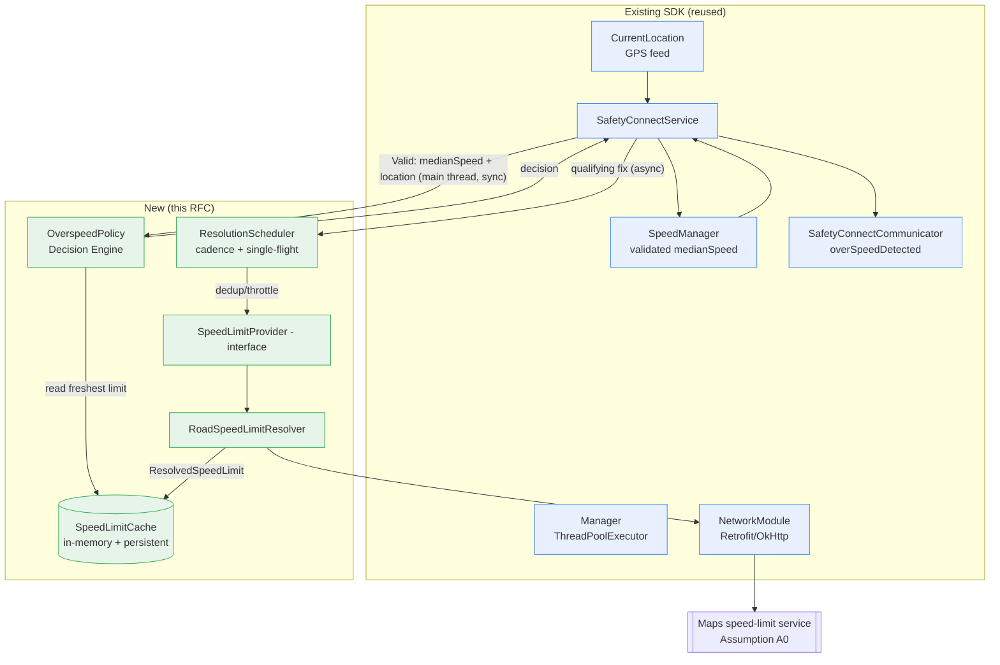
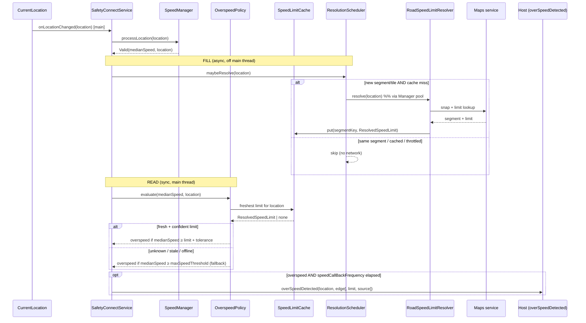

# RFC: Context-Aware Road Speed Limits

| | |
|---|---|
| **Status** | Draft for review (CIO, Engineering Head, SDK developers) |
| **Author** | SDK Architecture |
| **Scope** | BRD **F2.1** — Context-aware speed limits via map API (ROADMAP item 3) |
| **Baseline** | Current repo `main`; see `REFERENCE_IMPLEMENTATION.md` |
| **Non-scope** | Every other BRD item (bike/2W, cab/public transport, crash, harsh-driving, trip lifecycle). Vendor selection, commercials, procurement. |

> **Assumption A0 (stated up front):** A Google Maps Platform road-speed-limit
> capability is available to Airtel and returns, for a GPS point, a snapped road
> segment and its posted speed limit. This RFC treats that capability as an
> abstract *speed-limit service* behind an interface; the specific product and
> its commercials are out of scope by instruction. Where the design depends on a
> property of that service, it is marked **[Assumption]**.

---

## 1. Problem Statement

Overspeed today is decided against a **single fixed threshold**
(`SensorFilters.maxSpeedThreshold`, default 60 km/h). One number cannot be
correct across a service area that spans residential lanes (30 km/h), arterials
(50–60), and expressways (80–120). The consequences, per the BRD:

- A driver legally travelling 90 km/h on an expressway is flagged as overspeeding
  → **false positive**.
- A driver doing 45 km/h in a 30 km/h school zone is **not** flagged → **false
  negative**.

The BRD's central problem is **alert fatigue**: "tens of thousands of alert
events per day, the vast majority false positives," to the point that "users have
learned to ignore the resulting alerts." Fixed-threshold overspeed is a primary
contributor. The safety pipeline downstream (risk score, consequence engine) is
"garbage-in" until these false positives are removed.

**We must replace the fixed threshold in the overspeed decision with the actual
posted speed limit of the road the driver is on**, while preserving today's
fail-safe behaviour and not destabilising the existing SDK.

---

## 2. Goals

1. Decide overspeed against the **road's posted speed limit** for the driver's
   current location, not a global constant.
2. **Materially reduce false-positive overspeed alerts** (the BRD's success metric)
   without increasing false negatives.
3. **Fail safe and fail closed to today's behaviour**: if a limit is unknown,
   stale, or the network is down, fall back to the current fixed-threshold logic —
   never crash, never block the location thread, never regress.
4. **Minimal, contained change** to the existing SDK: reuse `SpeedManager`,
   `CurrentLocation`, `Manager`, `NetworkModule`, and the existing callback
   surface; isolate all new logic behind one abstraction.
5. **Bounded, predictable API cost** at 10k → 1M users via caching and resolution
   throttling.
6. **Shippable incrementally** behind a config flag, with a shadow-mode validation
   stage and an instant kill switch.

---

## 3. Non-Goals

- Not changing GPS acquisition, speed *measurement*, or speed *validation*
  (`CurrentLocation` and `SpeedManager` are reused as-is).
- Not building an on-device map/speed-limit database in v1 (listed as a future
  improvement, §17).
- Not handling conditional/variable limits (time-of-day, weather, vehicle-class)
  in v1 (§17).
- Not modifying harsh-driving, EMF, crash, or trip-gate behaviour.
- Not selecting a vendor, negotiating quota, or costing the API (out of scope by
  instruction).
- Not redesigning the SDK's threading, lifecycle, or service model.

---

## 4. Current Architecture — how overspeed works today

Traced from `SafetyConnectService` and `SpeedManager` (see
`REFERENCE_IMPLEMENTATION.md` §2).

1. `CurrentLocation` requests GPS updates and delivers each `Location` on the
   **main thread** to `SafetyConnectService.onLocationChanged`.
2. `processLocationUpdate` optionally applies the `TripGate` IN_VEHICLE gate, then
   calls `SpeedManager.processLocation(location)`.
3. `SpeedManager` validates the fix (rejects `accuracy > 50 m` and `!hasSpeed()`),
   maintains a rolling window of 5 accepted readings, and returns `SpeedResult`:
   `Stationary` / `Collecting` / `Valid(currentSpeed, medianSpeed, location)`.
4. On `Valid`, `handleValidSpeed` performs the **decision**:
   > *if `maxSpeedThreshold` ≤ `medianSpeed` → `fireOverSpeedingEvent(...)`.*
5. `fireOverSpeedingEvent` throttles on `speedCallBackFrequency` (default 30 s) and
   calls `notifyAllOverSpeedDetectedListener(location, speedDetectionEdge)` →
   host `SafetyConnectCommunicator.overSpeedDetected(...)`.

**The entire feature reduces to changing the comparand in step 4**: the constant
`maxSpeedThreshold` becomes a *road-derived limit for the current location*, with
`maxSpeedThreshold` retained as the fallback. Everything else in the pipeline is
reused unchanged. This is the single most important architectural observation in
this RFC — it is why the change is contained.

---

## 5. Proposed Architecture

### 5.1 Design principles (with reasoning)

- **P1 — Decide on the validated speed, resolve on the validated location.**
  We hang the feature off the existing `SpeedResult.Valid` path, reusing
  `SpeedManager`'s filtered `medianSpeed` and accepted `location`.
  *Reasoning:* resolving road limits against raw, noisy GPS wastes API calls and
  produces wrong decisions; `SpeedManager` already rejects bad fixes and GPS jumps.
- **P2 — Never call the network on the location/main thread.** The decision reads a
  **cache** synchronously; a separate **resolver** fills that cache
  **asynchronously** on the existing `Manager` thread pool.
  *Reasoning:* locations arrive on the main executor at up to ~0.5 Hz; a synchronous
  HTTP call there would ANR and drain battery. This is the primary risk the design
  must engineer around.
- **P3 — Cache-first, throttled resolution.** Resolve only on cache miss *and* when
  the vehicle has entered a new road segment / spatial tile — not on every fix.
  *Reasoning:* speed limits are static per segment; a segment is traversed over many
  fixes. Without throttling, a 2 s GPS cadence yields ~1,800 calls/hour/user.
- **P4 — Fail safe to the status quo.** Unknown / stale / offline / low-confidence →
  fall back to `maxSpeedThreshold`. The feature is strictly additive.
  *Reasoning:* we must not regress an in-production safety alert.
- **P5 — Isolate the vendor behind one interface.** All map access sits behind a
  `SpeedLimitProvider` seam.
  *Reasoning:* vendor is out of scope and may change; the seam also enables
  shadow-mode, unit tests, and offline stubs.

### 5.2 Component classification (explicit, per instruction)

**Existing components — reused unchanged:**

| Component | Role in this feature |
|---|---|
| `CurrentLocation` | Unchanged GPS feed. |
| `SpeedManager` | Unchanged; its `SpeedResult.Valid.medianSpeed` + `location` are the inputs. |
| `Manager` (`ThreadPoolExecutor`) | Reused to run road resolution off the main thread. |
| `NetworkModule` (Retrofit/OkHttp) | Reused HTTP stack (already powers the crash-upload pipeline). |
| `SafetyConnectCommunicator` | Reused callback surface for `overSpeedDetected`. |
| `TripGate`, `NotificationManager`, `PermissionValidator` | Untouched. |

**Modified components — small, additive edits:**

| Component | Change | Reasoning |
|---|---|---|
| `SafetyConnectService.handleValidSpeed` | Replace the direct `maxSpeedThreshold` compare with a call into the new **OverspeedPolicy**, passing `medianSpeed` + `location`. | This is the single decision point; the change is one delegated call. |
| `SensorFilters` | Add optional config (enable flag, tolerance, cache TTL, resolution cadence, request timeout, fallback behaviour), all with safe defaults. | Config already flows through `SensorFilters`; no init-path change. |
| `NetworkModule` | Add the speed-limit service endpoint definition. | Additive; reuses the existing client/interceptors. |
| `SafetyConnectCommunicator` *(optional / open question)* | Optionally surface the resolved limit + source to the host on `overSpeedDetected`. | Enriches host UX; interface change is breaking, so **additive-only** — see §16 Q1. |

**New components:**

| Component | One-line responsibility |
|---|---|
| `SpeedLimitProvider` (interface) | The vendor-neutral seam: "resolve a limit for this location." |
| `RoadSpeedLimitResolver` | Concrete provider: snaps a point to a road and looks up its posted limit via `NetworkModule`. |
| `SpeedLimitCache` | Two-tier (in-memory + optional persistent) store of resolved limits keyed by road segment / tile. |
| `ResolutionScheduler` | Decides *when* to resolve (cadence/tile throttle + single-flight dedup); runs work on `Manager`. |
| `OverspeedPolicy` (Decision Engine) | Applies tolerance/hysteresis and fallback; returns the overspeed decision. |
| `ResolvedSpeedLimit` (data model) | Value object: limit, source, confidence, segment key, timestamp. |

### 5.3 How it integrates

The new components form a **read-fast / fill-slow** pair around the existing
decision point:

- **Fill (async):** on qualifying location updates, `ResolutionScheduler` (on the
  `Manager` pool) asks `RoadSpeedLimitResolver` (via `SpeedLimitProvider`) to resolve
  the current segment; results land in `SpeedLimitCache`.
- **Read (sync, on main):** `handleValidSpeed` asks `OverspeedPolicy` for a decision;
  `OverspeedPolicy` reads the freshest cached `ResolvedSpeedLimit` for the location
  and compares against `medianSpeed`, falling back to `maxSpeedThreshold` when the
  cache has nothing fresh/confident. No network on this path.

---

## 6. Architecture Diagram

---

## 7. Sequence Diagram

---

## 8. Data Flow — GPS → Road Resolution → Speed Limit → Decision → Alert

1. **GPS.** `CurrentLocation` emits a `Location`. `SpeedManager` validates it and,
   on the 5-reading window, yields `Valid(currentSpeed, medianSpeed, location)`.
   *Only validated fixes proceed* (P1).
2. **Road Resolution.** `ResolutionScheduler` decides whether this fix warrants a
   resolution: it computes a **spatial key** (segment id if available, else a tile /
   geohash) and resolves **only if** the key changed since the last resolution *and*
   the cache lacks a fresh entry, applying a **single-flight** guard so concurrent
   fixes for the same key trigger at most one request. Qualifying work runs on the
   `Manager` pool; `RoadSpeedLimitResolver` snaps the point to a road and requests
   the posted limit through `NetworkModule`.
3. **Speed Limit.** The resolver produces a `ResolvedSpeedLimit` — {value,
   source, confidence, segmentKey, timestamp} — and writes it to `SpeedLimitCache`.
   "No road / no data" is stored as an explicit **negative** result (with a shorter
   TTL) so it is not retried on every fix.
4. **Decision Engine.** On the main thread, `OverspeedPolicy.evaluate(medianSpeed,
   location)` reads the **freshest confident** cached limit for the location. It
   computes an **effective limit** = cached limit if fresh & confident, else
   `maxSpeedThreshold` (fallback, P4). Overspeed is declared when
   `medianSpeed ≥ effectiveLimit + tolerance`, where tolerance is a configurable
   absolute or percentage margin, applied with hysteresis to prevent flapping at
   segment boundaries.
5. **Alert.** If overspeed is declared and `speedCallBackFrequency` has elapsed,
   `fireOverSpeedingEvent` (unchanged) calls `overSpeedDetected(...)`. Optionally the
   resolved limit and source are surfaced to the host (§16 Q1).

Every step degrades to fallback if the prior step yields nothing usable; the alert
path is never blocked waiting on resolution.

---

## 9. Component Design

### 9.1 SpeedLimitProvider *(New — interface)*
- **Purpose:** vendor-neutral seam for "limit for this location."
- **Responsibilities:** define the resolve contract and the `ResolvedSpeedLimit`
  shape; nothing else.
- **Inputs:** a validated location (and optionally bearing, to disambiguate
  divided roads — [Assumption] service accepts/uses heading).
- **Outputs:** a `ResolvedSpeedLimit` or an explicit "unknown".
- **Failure handling:** N/A (contract only); implementations must not throw across
  the boundary — they return "unknown".
- **Ownership:** SDK core team.

### 9.2 RoadSpeedLimitResolver *(New)*
- **Purpose:** concrete `SpeedLimitProvider` backed by the maps service.
- **Responsibilities:** snap point→road, look up posted limit, normalise units to
  km/h, attach source/confidence/timestamp, translate transport/HTTP errors into
  "unknown", enforce a **short per-request timeout**.
- **Inputs:** validated location (+bearing); config (timeout).
- **Outputs:** `ResolvedSpeedLimit` | unknown.
- **Failure handling:** timeout, non-200, empty/garbage response, or off-road →
  return "unknown"; apply per-segment backoff to avoid hammering.
- **Ownership:** SDK core team; the maps endpoint definition lives in `NetworkModule`.

### 9.3 SpeedLimitCache *(New)*
- **Purpose:** eliminate repeat lookups for a segment already resolved.
- **Responsibilities:** store/retrieve `ResolvedSpeedLimit` by spatial key; enforce
  TTL and size bounds; expose "freshest confident limit near location"; hold
  negative results separately with a shorter TTL.
- **Inputs:** spatial key, `ResolvedSpeedLimit`.
- **Outputs:** cached limit or miss.
- **Failure handling:** on persistent-store I/O error, degrade to in-memory only;
  never throw to callers.
- **Ownership:** SDK core team. (Cross-user/server cache is a backend concern — §14.)

### 9.4 ResolutionScheduler *(New)*
- **Purpose:** convert a stream of fixes into the *minimum* set of resolutions.
- **Responsibilities:** compute spatial key; suppress resolution when key unchanged
  or a fresh entry exists; single-flight concurrent misses; dispatch to `Manager`;
  apply distance/time cadence and backoff; optional look-ahead prefetch (§17).
- **Inputs:** validated location; cache state; config (cadence, tile size).
- **Outputs:** side-effect — populated cache.
- **Failure handling:** scheduler errors are swallowed and logged (resolution is
  best-effort; the decision path always has fallback).
- **Ownership:** SDK core team.

### 9.5 OverspeedPolicy (Decision Engine) *(New)*
- **Purpose:** the sole overspeed decision, road-limit-aware with fallback.
- **Responsibilities:** select effective limit (cache vs `maxSpeedThreshold`); apply
  tolerance + hysteresis; return decision; **must be synchronous, allocation-light,
  non-blocking** (runs on the main thread inside `handleValidSpeed`).
- **Inputs:** `medianSpeed`, `location`, cache handle, `SensorFilters`.
- **Outputs:** boolean overspeed (+ the effective limit/source for telemetry).
- **Failure handling:** any internal error → default to fixed-threshold decision.
- **Ownership:** SDK core team.

### 9.6 ResolvedSpeedLimit *(New — data model)*
- **Purpose:** immutable value carrying a limit and its provenance.
- **Fields:** value (km/h), source, confidence, segmentKey, timestamp, isNegative.
- **Ownership:** SDK core team.

### 9.7 Modified: SafetyConnectService / SensorFilters / NetworkModule
- **`handleValidSpeed`:** delegate the compare to `OverspeedPolicy` and fire the
  (unchanged) `fireOverSpeedingEvent` on a positive decision. Also hand the fix to
  `ResolutionScheduler`. **Failure handling:** if the policy or scheduler is absent
  or errors, behave exactly as today.
- **`SensorFilters`:** new optional fields (§10/§12 defaults). No init-path change.
- **`NetworkModule`:** add the speed-limit endpoint; reuse existing interceptors,
  timeouts, and connection pool.

---

## 10. Caching Strategy

- **Why cache at all:** posted limits are effectively static per road segment and a
  segment spans many GPS fixes and many trips. Caching is the difference between
  "a few calls per trip" and "thousands." This is the load-bearing cost control.
- **Topology — two tiers:**
  - **In-memory LRU** (hot, per process) — bounded (e.g., a few hundred to low
    thousands of entries). Serves the current trip with zero I/O.
  - **Persistent on-device cache** (optional, v1.1) — survives app restarts so a
    daily field route re-warms instantly. [Assumption] a small key-value/embedded
    store is acceptable on the host.
  - **Server-side shared cache** (backend, at scale) — see §14; a limit resolved for
    one driver on a public road is valid for all drivers.
- **Key:** the road **segment id** if the service returns one — most precise; else a
  **spatial tile / geohash** (≈150 m at geohash-7). **Trade-off [Assumption]:**
  segment ids need snapping and are exact; tiles are cheap but can straddle two roads
  (a tile key may return the wrong road near intersections/overpasses). Recommend
  segment-id keying when available, tile keying as fallback, with bearing used to
  disambiguate.
- **Expiry / TTL:** long, because limits rarely change — **[Assumption] 30–90 days**
  for positive entries (tunable via `SensorFilters`), effectively permanent within a
  trip. Use an ETag/version if the service exposes one so refresh is conditional.
  **Negative** entries ("no road/limit") get a **short** TTL (minutes) to allow
  recovery without per-fix retries.
- **When Google is called:** only on a **cache miss for the current key** *and* when
  the `ResolutionScheduler` cadence permits (new segment/tile, distance moved beyond
  threshold). Never on a hit, never on the decision path.
- **Avoiding repeated calls:** (a) segment/tile de-duplication; (b) **single-flight**
  so concurrent misses for one key issue one request; (c) negative caching;
  (d) per-segment **backoff** after failures; (e) **[Assumption] batch snapping** —
  if the service accepts multiple points per request (Roads-style APIs typically
  accept up to ~100), the resolver can amortise look-ahead points into one call.

---

## 11. Offline Behaviour

The decision path is designed so that *every* degraded condition collapses to the
current fixed-threshold behaviour — never a crash, never a block.

| Condition | Behaviour | Reasoning |
|---|---|---|
| **Internet unavailable** | Serve from cache; on miss, `OverspeedPolicy` falls back to `maxSpeedThreshold`. No queuing (limits are read-only; a stale request has no value later). | Fail-safe (P4); a queued lookup for a road already passed is useless. |
| **Google timeout** | Short per-request timeout in `RoadSpeedLimitResolver`; on timeout return "unknown" → fallback; apply per-segment backoff; never retry inline. | A slow call must not delay the *next* fix or the decision. |
| **No road found** (parking lot, off-road) | Store a **negative** entry; fallback threshold applies; optionally suppress overspeed entirely when confidently off-road (config). | Avoids re-querying dead points every fix; "no road" ≠ "0 limit". |
| **GPS drift** | `SpeedManager` already rejects `accuracy > 50 m` and jump anomalies, so drift usually never reaches the decision. If a snapped point is implausibly far from the raw fix, resolver marks **low confidence** → treated as unknown → fallback. | Reuse existing validation; don't trust a limit snapped from a bad fix. |
| **Tunnel** (GPS lost) | No new fixes → last confident limit is retained for a **bounded staleness window** (config), then fallback. Never fabricate a limit. | Short-lived continuity without asserting stale data indefinitely. |

---

## 12. Performance

Baseline constraint: locations arrive on the **main thread**; the crash pipeline
already runs periodic network I/O via `NetworkModule`.

- **Battery — the dominant risk.** Controlled by (a) resolving off-thread on
  `Manager`, (b) **cadence throttling** (resolve per new segment, not per fix),
  (c) cache hits requiring zero radio, (d) reusing OkHttp's connection pool
  (no new sockets/handshakes), (e) batch/look-ahead to cut request count.
  *Reasoning:* radio wake-ups dominate mobile battery; call count is the lever.
- **Network — illustrative volume [Assumption].** Naïve (per 2 s fix) ≈ 1,800
  calls/hour/driver — unacceptable. With segment/tile caching + cadence, a ~30-min
  urban trip crossing ~30–80 segments → **tens of first-time calls, then near-zero**;
  a repeated daily route with persistent cache → **near-zero**. Batch snapping and a
  server-side shared cache push covered geographies toward zero (§14).
- **Memory.** Bounded LRU with compact value objects; negative cache capped
  separately. Target footprint small (low hundreds of KB). *Reasoning:* the SDK runs
  inside a field-workforce app; memory must stay modest.
- **CPU.** Spatial-key computation (geohash/segment) is cheap and off the main
  thread; snapping is done server-side. The main-thread `OverspeedPolicy` read is a
  cache lookup + comparison — negligible.

---

## 13. Security

- **API keys — never embed a usable maps key in the SDK/APK.** An APK is
  decompilable; an embedded key is exfiltratable and abusable.
  - **Recommended: backend proxy.** The SDK calls an **Airtel-owned endpoint**
    (via `NetworkModule`) that injects the maps key server-side. *Reasoning:* keeps
    the key off-device, enables rotation without an app release, and centralises rate
    limiting, quotas, and abuse detection. This also unlocks the server-side shared
    cache (§14) at no extra client cost.
  - **Fallback: direct-to-Google** only with Android app restrictions (package name +
    signing SHA-1) and tight per-key quotas — **[Assumption]** acceptable residual
    risk; documented as inferior because restrictions are bypassable and quotas are
    the only real backstop.
- **Authentication.** The proxy sits behind Airtel's existing app authentication;
  the SDK presents the host's session/token via `NetworkModule` interceptors
  (reused). No new auth system.
- **Rate limiting.** Enforced at the proxy (per-user and per-device ceilings), backed
  by client-side cadence + cache. *Reasoning:* defence in depth — client throttling
  reduces cost, server throttling contains abuse the client can't be trusted to.
- **Abuse prevention.** Proxy-side anomaly detection (implausible call rates,
  impossible geographies), quota shedding, and key rotation. The SDK contributes by
  never exposing raw map credentials and by bounding its own request rate.

---

## 14. Scalability

The decisive property [Assumption]: **posted limits are a shared public constant** —
a segment resolved for one driver is valid for every driver. This makes a
**server-side shared cache the primary scaling lever**.

- **10,000 users.** Client cache + cadence suffice. Direct-to-Google (restricted key)
  or proxy both work. Per-driver call volume is low; total is comfortably within
  normal quotas. Proxy still recommended for key hygiene.
- **100,000 users.** Proxy + **shared server-side cache** (e.g., Redis/edge) strongly
  recommended: popular arterials/expressways are resolved **once** and served to all
  drivers → cross-user hit rate is high, so upstream Google calls scale with *unique
  segments driven*, not user count. Add quota governance and per-tenant limits.
- **1,000,000 users.** Google call volume should track **the road network, not the
  fleet** — bounded by the number of distinct segments Airtel's users traverse, which
  is finite and largely pre-warmable. Options that flatten cost further: pre-resolve
  and periodically refresh a **tiled speed-limit dataset** for the operating
  geography, served from Airtel infra, reducing live Google calls toward zero for
  covered areas (this is the on-ramp to the on-device dataset in §17). Client behaviour
  is identical at every tier — the SDK always talks to one endpoint and always caches;
  scale is absorbed behind that endpoint.

*Architectural implication:* the **[Assumption] backend proxy + shared cache** is not
just a security choice — it is the mechanism that makes 1M users affordable. The SDK
design deliberately keeps the client oblivious to which tier is behind the endpoint.

---

## 15. Rollout Plan

1. **POC (engineering).** `SpeedLimitProvider` + `RoadSpeedLimitResolver` +
   `SpeedLimitCache` behind a config flag; validate snapping accuracy and limit
   correctness on a handful of known segments; confirm no main-thread work and no
   battery regression. Exit: a validated fix→limit path.
2. **Internal / dogfood — SHADOW MODE.** Compute the road-aware decision **but keep
   alerting on the fixed threshold**; log the divergence (road-limit decision vs
   fixed-threshold decision) as telemetry. *Reasoning:* this quantifies the
   false-positive reduction and surfaces snapping errors **before** any user sees a
   behaviour change — the single most valuable de-risking step. Exit: measured FP
   reduction and acceptable snapping error.
3. **Pilot.** Enable road-aware alerting for a small cohort via the `SensorFilters`
   flag / remote config. Compare alert volume and driver feedback against control.
   Exit: FP reduction confirmed in the field, no safety false-negative regressions.
4. **Production.** Gradual ramp via the flag. **Kill switch = the enable flag**
   (instant revert to fixed threshold, since fallback is always present). Monitor API
   cost, cache hit rate, timeout rate, and alert volume.

---

## 16. Open Questions

1. **Host callback surface.** Should `overSpeedDetected` carry the resolved limit +
   source? The interface is a breaking change if modified in place; recommend an
   **additive** signal (new optional callback with a default, or reuse the existing
   `speedDetectionEdge` string as a metadata channel). Decision needed with host team.
2. **Cache key.** Segment-id vs tile/geohash depends on what the maps response
   actually returns [Assumption]; confirm before finalising `SpeedLimitCache`.
3. **Direct-to-Google vs backend proxy.** Recommended proxy requires backend
   ownership + effort. Who owns the endpoint and the shared cache? (Blocks §13/§14.)
4. **Persistent cache.** Is on-device persistence (and its storage footprint)
   acceptable to the host app, or is in-memory-only sufficient for v1?
5. **Comparand.** Decision on `medianSpeed` (recommended — already smoothed) vs
   instantaneous speed; and tolerance expressed as absolute km/h vs percentage.
6. **Config location.** Enable flag and tunables in `SensorFilters` (static per init)
   vs remote config for live control without an app release.
7. **Limit availability/coverage** for the operating geography [Assumption]; drives
   how often fallback is exercised and thus the realised FP reduction.

---

## 17. Future Improvements (road-speed only)

- **Predictive prefetch along heading/route.** Resolve segments *ahead* of the driver
  using bearing (and route if the host shares one) to eliminate first-hit latency and
  misses. The `ResolutionScheduler` already owns cadence — this is an extension of it.
- **On-device / offline speed-limit dataset.** Ship or sync tiled limit packs for the
  operating geography so common roads need no live call — the natural end-state of the
  §14 server dataset; removes the network from the hot path.
- **Conditional / variable limits.** Time-of-day, weather, and vehicle-class-specific
  limits, once the base feature is stable and the data source supports them.
- **Confidence-weighted alerting.** Modulate alert firing (or escalation) by the
  resolved limit's confidence/source reliability, reducing borderline false positives.
- **Bearing-based road disambiguation.** Use heading to resolve divided highways,
  service roads, and overpasses that share a tile, improving snap correctness.
- **Cross-user cache warming.** Proactively pre-resolve high-traffic corridors from
  aggregate fleet movement so the shared cache is hot before drivers arrive.

---

### Appendix — Summary of changes by type

- **Existing (reused, unchanged):** `CurrentLocation`, `SpeedManager`, `Manager`,
  `NetworkModule`, `TripGate`, `NotificationManager`, `PermissionValidator`,
  `SafetyConnectCommunicator`.
- **Modified (small/additive):** `SafetyConnectService.handleValidSpeed`,
  `SensorFilters`, `NetworkModule` (endpoint), optionally `SafetyConnectCommunicator`
  (additive).
- **New:** `SpeedLimitProvider`, `RoadSpeedLimitResolver`, `SpeedLimitCache`,
  `ResolutionScheduler`, `OverspeedPolicy`, `ResolvedSpeedLimit`.

*Net footprint on the existing SDK: one delegated decision call and a handful of
optional config fields. All new behaviour lives behind `SpeedLimitProvider` and
`OverspeedPolicy`, and every degraded path falls back to today's proven logic.*
